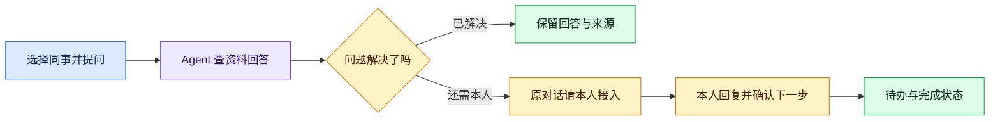
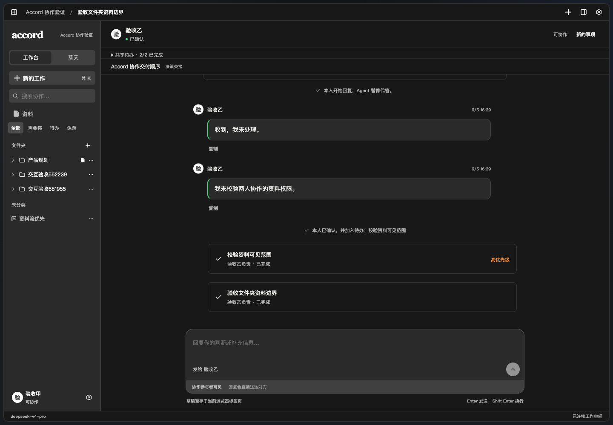
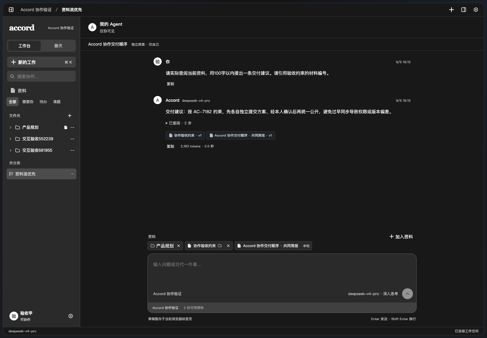
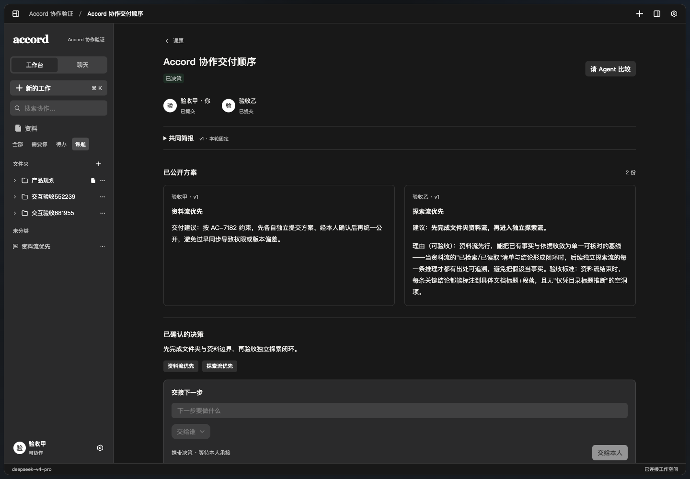

# Accord · 拍办 Paiban

**找同事时，让他的 AI 先接一句；需要本人决定，再把事情交给本人。**

你想问开发同事「这个接口今天能联调吗」，却不知道他正在忙什么。一个简单的问题，最后变成了几条催促消息，或者一场临时会议。

我们想把这类沟通变简单：每个人都有自己的 AI 助手（Agent）。它先根据有权使用的资料回答问题；如果还需要本人参与，你点一下「请本人接入」，对方就在原来的对话里接着聊。商量好的下一步，由负责人确认后进入待办。

这是 AlxOrigin Team 的黑客松项目。**目前已跑通：资料问答 → 转交本人 → 原地回复 → 确认待办 → 完成任务。**

[现场体验](http://10.156.31.199:5188/) · [查看路演 PDF](docs/参赛材料/2026-09-05-001-拍办路演-盛弘.pdf) · [下载 PPT](docs/参赛材料/2026-09-05-001-拍办路演-盛弘.pptx) · [查看代码](apps)

> 体验地址需要与团队电脑连接同一局域网，并使用团队提供的邀请注册账号。地址已于 9 月 5 日验证可访问，临时开放至 9 月 6 日 00:00（北京时间）；换网或电脑离线会失效。异地评委可以先看下面的界面和路演材料。

## 一件事，怎么从「问一下」变成「办好了」

以「确认前端联调安排」为例：

1. **找人。** 在聊天列表选择负责接口的同事，每位同事对应一个聊天入口。
2. **先问 Agent。** 它读取本次允许使用的资料，给出回答，并显示查阅来源。资料里没有答案，就需要进一步确认。
3. **需要本人时，直接转交。** 点击「请本人接入」，可以补一句说明，也可以指定送达时间。对方在同一个对话里回复，不必把事情再讲一遍。
4. **把下一步定下来。** 负责人在对话中填写任务和结论，点击确认，任务进入待办；完成后就地标记完成。



**本人接续和任务确认，都留在当前对话里。**



截图拍摄于 2026 年 9 月 5 日，使用隔离验收账号操作当前应用。这里展示的是实际保存的对话和任务，没有放入团队成员的私人聊天记录。

## CP1：现在可以实际操作什么

| 已完成 | 评委可以怎么检查 |
| --- | --- |
| 账号与邀请 | 创建工作空间，邀请另一位成员用自己的账号加入 |
| 真实 AI 问答 | 添加文字资料后提问，查看回答、来源、生成状态和实际用量；失败可重试，生成可停止 |
| 找同事与转交本人 | Agent 先回答，发起人选择立即或定时转交，本人在原对话接续 |
| 任务承接与完成 | 本人确认任务，设置优先级，标记完成；刷新后记录仍在 |
| 文件夹和资料引用 | 整理聊天，拖动到文件夹；给会话挂载或移除可用资料 |
| 各自思考，再一起决定 | 发起课题，各自与 Agent 探索并提交方案；主持人统一公开，比较方案、记录决定，再交接负责人 |
| 有边界的工作状态 | 本人开启后，分享在 Accord 工作或聊天的状态；有权查看的任务可见优先级及完成状态 |

**AI 确实会查资料。** 下图中的回答由 DeepSeek 生成，来源、资料版本和调用用量都来自运行记录。



**多人讨论也可以先各自想清楚。** 下面两份方案分别提交后，再统一公开；最后的决定由人填写。



本次发布前已通过 **42 项后端测试、5 项浏览器能力与预览边界测试、TypeScript 类型检查、生产构建和 UI 规范检查**。另用浏览器重新打开资料问答、课题决策、聊天交接与待办页面并截图，未发现页面脚本错误。自动化测试覆盖权限和状态变化；真实模型调用另有实际运行记录，不能用测试数量代替真实调用。

## 产品范围：先解决哪三件事

我们首先服务需要频繁互相配合的小型项目团队，例如黑客松小队、产品研发团队。目标是让普通的信息确认少打扰人，让需要判断的事更快找到负责人。

| 场景 | 用户希望得到什么 | 当前进展 |
| --- | --- | --- |
| 找同事 | 先获得有依据的回答；不够再找本人，继续同一段对话 | 核心流程已实现 |
| 开会 | 同步信息先由 Agent 收集；需要决策时再找关键人员进同一会议室 | 已完成流程设计，会议模块尚未实现 |
| 分配任务 | 填写任务与背景，Agent 推荐 1–3 位人选，发起人选择后进入对方待办 | 已完成流程设计；当前支持的是本人承接任务，尚无自动推荐和直接分配 |

开会的设计分两种：**同步会**先收集信息，给发起人一份汇总，再由他决定是否找人单聊；**决策会**先准备资料、推荐必须到场的人，再进入实时讨论。结束后整理结论，有待办则让相关人员确认，没有待办则按可见范围保存记录。

这些流程需要继续开发。当前的「课题」支持异步提交和决策，不能当作已经完成的实时会议室。

## 接下来做什么，难点在哪里

| 顺序 | 剩余工作与计划 | 怎样算完成 |
| --- | --- | --- |
| 先完成聊天收尾 | 增加手动结束、30 分钟无消息结束本轮、会后下一步建议和记忆保存 | 双方可结束本轮；系统只对本轮内容整理，不重复创建任务 |
| 再接会议与任务推荐 | 复用已有资料权限、对话和任务接口，加入信息收集、参会人推荐、会议室以及 1–3 人任务候选 | 至少两人完成一次信息同步或决策；推荐有依据，最终选择由人操作 |
| 补齐团队长期使用条件 | 正式部署、账号恢复、通知、备份；继续接入文件和外部工作资料 | 电脑离线后服务仍可访问，团队数据能够恢复 |

当前有三个具体难点：

- **Agent 能读，不等于可以转述给所有人。** 服务端已检查会话和资料权限，移动聊天不自动扩大权限；后续接入会议、记忆和外部资料时，需要继续遵守同一规则。
- **AI 给出的建议，怎样变成真正的任务。** 当前由本人确认后写入待办，模型不能凭一句话代替人承诺。后续「发起人直接分配」还需要明确谁有分配权限。
- **模型慢、失败或中途停止时，工作不能丢。** 现有消息和任务会保存，模型运行可停止、重试并记录用量。会议中多人同时调用、自动整理后的重复处理，仍需进一步验证。

目前没有自动读取同事的私人聊天、全盘扫描电脑、识别其他软件中的会议，也没有离线模型兜底。模型调用需要联网；允许用于回答的内容会发送给配置的模型服务商。

## 技术为什么能落地

浏览器负责展示对话，服务端检查权限、保存工作记录并调用模型。前端不持有模型密钥。

| 部分 | 当前实现 |
| --- | --- |
| 界面 | React + TypeScript + Vite，使用 Tutti UI System 的组件和样式 |
| 服务 | Python + FastAPI；账号、资料权限、转交和任务由服务端校验 |
| 数据 | SQLite，保存账号、聊天、资料、任务和模型运行记录 |
| AI | DeepSeek V4 Pro，通过工具读取已授权资料；支持调整思考强度 |
| 运行方式 | 单工作空间、单 API 进程，可在一台电脑上启动并向局域网开放 |

目前网页轮询服务端取得进展，不是 WebSocket 实时业务推送。已经复用了成熟的界面组件；本项目实现的是中文工作台、协作流程、权限和模型接入。具体来源见 [第三方与团队代码说明](THIRD_PARTY_NOTICES.md)。

## 团队怎么分工

以下按盛弘路演 PPT 的团队页整理，使用材料中的姓名与职责。

| 成员 | 角色 | 负责的部分 |
| --- | --- | --- |
| 堡天 | CEO | 产品方向、商业化与变现路径 |
| 建城 | CTO | 多智能体架构、AI 全栈开发与工程落地 |
| 书傲 | 设计总监 | 产品体验、交互与视觉设计 |
| 盛弘 | 融资总监 | 资本路径、融资推进与合规边界 |

## 参赛材料与阅读入口

- **进展说明：** 本 README 已列出已完成部分、剩余计划和技术难点，对应 CP1 的项目进展（40%）、技术可行性（20%）、问题与场景（20%）、安排与分工（20%）。
- **路演材料：** [在线查看 PDF](docs/参赛材料/2026-09-05-001-拍办路演-盛弘.pdf) / [下载 PPTX](docs/参赛材料/2026-09-05-001-拍办路演-盛弘.pptx)，从团队飞书原文件导出。
- **需求来源：** [团队 PRD](https://my.feishu.cn/docx/OauGdFaZRoh0ENxtpCfcGxRfnD1) 与 [最新用户体验流程](https://my.feishu.cn/docx/D6iLdPtQYoZ8d3xuIjscNcMInGT)（需要团队飞书权限）；本页「产品范围」已提供无需登录的简版说明。
- **代码入口：** [前端](apps/web/src) / [后端](apps/api/accord_api) / [后端测试](apps/api/tests)。

路演原稿保留了产品愿景和早期技术方案，其中自动会议、离线降级、模型名称、启动方式及商业验证状态，不作为本次已完成功能的证明。**当前能力以本 README 和仓库代码为准。** 本页未引用未经核验的节省时间、试用团队数或付费数据。

评审时间和权重采用团队提供的 CP1 通知：9 月 5 日 17:00–18:00 提交进展说明并进行流动巡场。本仓库是进展材料入口。

<details>
<summary><strong>开发者：在自己的电脑上运行</strong></summary>

需要 Node.js 22+、Python 3.9+，以及可用的 DeepSeek API Key。

```bash
git clone https://github.com/yht-4403/paiban.git
cd paiban
npm ci --ignore-scripts
python3 -m venv .venv
.venv/bin/python -m pip install -r apps/api/requirements.txt
cp .env.example .env
chmod 600 .env
```

在本机 `.env` 中填写 `ACCORD_LLM_API_KEY`。已有 `.env` 时请保留，勿覆盖或提交真实密钥。

分别打开两个终端，在仓库根目录运行：

```bash
# 终端一：API
.venv/bin/python tools/run-api.py
```

```bash
# 终端二：网页
npm run dev
```

打开 <http://127.0.0.1:5186>，首次使用时创建工作空间和自己的账号，再从设置中生成邀请码供另一位成员加入。数据默认保存在 `.local/workspace`，不随代码上传。

macOS 也可用 `python3 tools/dev-services.py start` 托管两个服务；`status` 查看状态，`stop` 停止。局域网共享用 `python3 tools/preview-services.py start --lan`，再用 `status` 查看当前地址；共享入口不允许首次创建管理员，应先在本机完成初始化。

验证命令：

```bash
PYTHONPATH=apps/api .venv/bin/python -m unittest discover -s apps/api/tests -q
npm run typecheck
npm run build
npm run check:ui
node --test tools/preview-boundary.test.mjs tools/browser-capabilities.test.mjs
```

`npm run build` 输出至 `apps/web/dist`，完整应用仍需要 API 服务。当前构建通过，但主脚本仍有超过 500 kB 的体积提示，后续需拆分优化。

工程和应用名为 **Accord**，团队路演材料使用 **拍办 / Paiban**，提交仓库名为 `paiban`。

</details>
