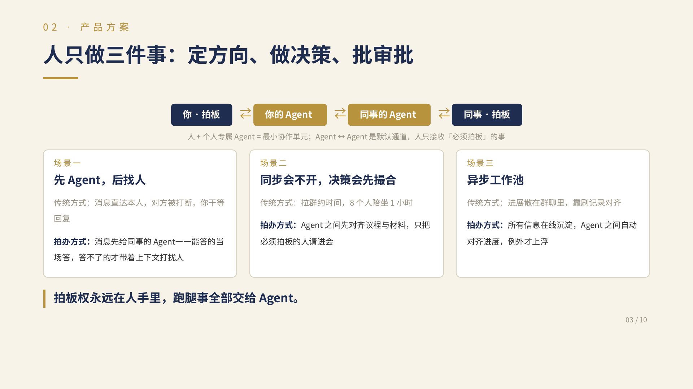
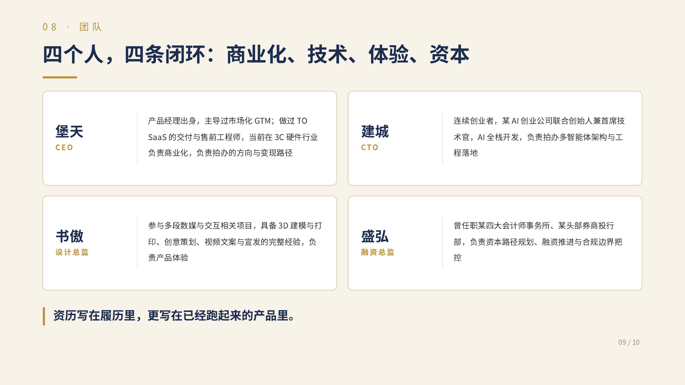

# 拍办

**你拍板，AI 办事。**

给每个人都在用 AI 的小团队，一套先问 Agent、再找本人的协作工具。日常问题先查资料回答，需要本人判断时再接入，商量好的下一步直接确认成待办。

[现场体验](http://10.156.31.199:5188/) · [路演 PDF](docs/参赛材料/2026-09-05-001-拍办路演-盛弘.pdf) · [下载 PPT](docs/参赛材料/2026-09-05-001-拍办路演-盛弘.pptx) · [源码](apps)

现场体验需同一局域网及邀请账号，临时开放至 **9 月 6 日 00:00（北京时间）**，换网或电脑离线后失效。

## 想解决什么问题

小团队里，一个人常常兼顾开发、产品和沟通。你问一句「接口今天能联调吗？」，对方就要停下手里的工作。拍办先让他的 Agent 根据授权资料回答；答案不够，再由你选择找本人。

下图摘自路演第 3 页，说明产品方向。**目前已实现资料问答、找本人和异步课题；图中的自动会议与 Agent 间自动对齐仍待开发。**



**和聊天里加一个 AI 插件有什么区别？** 我们把资料权限、Agent 代答、本人接续和任务承接接在同一条流程里，减少重复解释和来回切换。插件也能实现类似功能；我们要验证的是，这套完整流程能否让小团队更少被打断。

## CP1：已经做到了哪一步

**已跑通：查资料回答 → 原对话找本人 → 本人回复 → 确认待办 → 标记完成。**

| 已完成 | 可以实际操作什么 |
| --- | --- |
| 账号与协作 | 邀请成员加入；立即或定时转交本人，在原对话继续聊 |
| 真实 AI 问答 | DeepSeek 自动查阅授权资料与个人历史会话，展开出处，支持停止、重试 |
| 内容接入 | 批量导入文本、连接本机飞书文档、自动索引并按正文检索；新内容默认仅自己可见 |
| 工作台与待办 | 文件夹整理、聊天拖动、资料引用；本人确认任务、设置优先级并完成 |
| 异步讨论 | 各自探索并提交方案，统一公开后比较，由人决定、交接下一步 |
| 工作状态 | 本人开启后分享站内工作状态；私人聊天不会自动公开 |

技术采用 **React + Tutti UI System、FastAPI、SQLite、DeepSeek V4 Pro**，当前在一台电脑上运行。权限与任务状态由服务端控制，模型密钥留在服务端；模型调用需要联网。

9 月 5 日发布核验：**42 项后端测试、5 项专项测试、类型检查、构建和 UI 检查通过。**

<details>
<summary>查看当前界面的三张实拍截图</summary>

以下为 9 月 5 日使用隔离验收账号操作当前应用的截图。

**同一对话交接与确认任务**


**真实 AI 回答与资料来源**


**各自提交，一起决定**


</details>

## 接下来做什么

| 优先顺序 | 待完成 | 要解决的难点 |
| --- | --- | --- |
| 1. 聊天收尾 | 手动结束或闲置 30 分钟结束本轮，整理待办与记忆 | 不重复建任务，不把私人内容写进共享记忆 |
| 2. 会议与分配 | 先收集资料，再推荐参会人或 1–3 位任务人选，由人选择 | 推荐有依据，明确谁有分配权限 |
| 3. 长期使用 | 正式部署、账号恢复、通知与备份 | 电脑离线后仍可用，失败后可恢复 |

会议室、自动任务推荐和离线模型尚未实现。路演中的未来能力以本页进度为准。

## 谁在做

AlxOrigin Team，分工摘自路演第 9 页。



<details>
<summary>本地启动与更多资料</summary>

需要 **Node.js 22+、Python 3.9+ 和 DeepSeek API Key**。

```bash
git clone https://github.com/yht-4403/paiban.git
cd paiban
npm ci --ignore-scripts
python3 -m venv .venv
.venv/bin/python -m pip install -r apps/api/requirements.txt
cp .env.example .env
chmod 600 .env
```

在 `.env` 填写 `ACCORD_LLM_API_KEY`，已有配置不要覆盖，密钥不要提交。分别在两个终端运行：

```bash
# 终端一
.venv/bin/python tools/run-api.py
```

```bash
# 终端二
npm run dev
```

打开 <http://127.0.0.1:5186>，从六个固定身份中选择一个即可进入。建成、堡天、书傲属于演示协作范围，另外三个身份属于独立的体验协作范围；两组成员、资料、会话、会议和待办不会互相混入。每个浏览器标签页保持自己的身份，数据保存在 `.local/workspace`。macOS 也可用 `python3 tools/dev-services.py start` 托管服务，用 `python3 tools/preview-services.py start --lan` 开放局域网访问。

本地 Codex 可以把用户明确选中的文本成果放进团队工作池。首次选择固定身份后会在本机保存七天会话，不使用或保存密码：

```bash
python3 tools/accord_share.py login --account 建成
python3 tools/accord_share.py recent . --limit 12
python3 tools/accord_share.py publish path/to/result.md
```

CLI 只处理命令中指定的文件，不会自动公开私人聊天或扫描整个工作区。

- [Python 后端开发指南](apps/api/README.md) · [后端测试](apps/api/tests) · [第三方与团队代码来源](THIRD_PARTY_NOTICES.md)
- [CP1 详细进展记录](https://github.com/yht-4403/paiban/blob/a79cf3efcb072be819dadd4a907dca2cecf4d651/README.md)
- [团队 PRD](https://my.feishu.cn/docx/OauGdFaZRoh0ENxtpCfcGxRfnD1) · [用户体验流程](https://my.feishu.cn/docx/D6iLdPtQYoZ8d3xuIjscNcMInGT)（需飞书权限）

产品名统一为拍办；代码目录和兼容性命名仍保留 `accord`。两张方案与团队图片均由仓库内的路演原稿导出。

</details>
