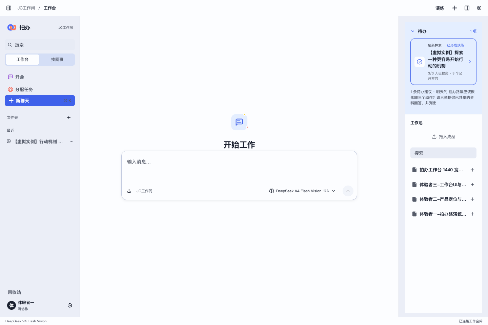
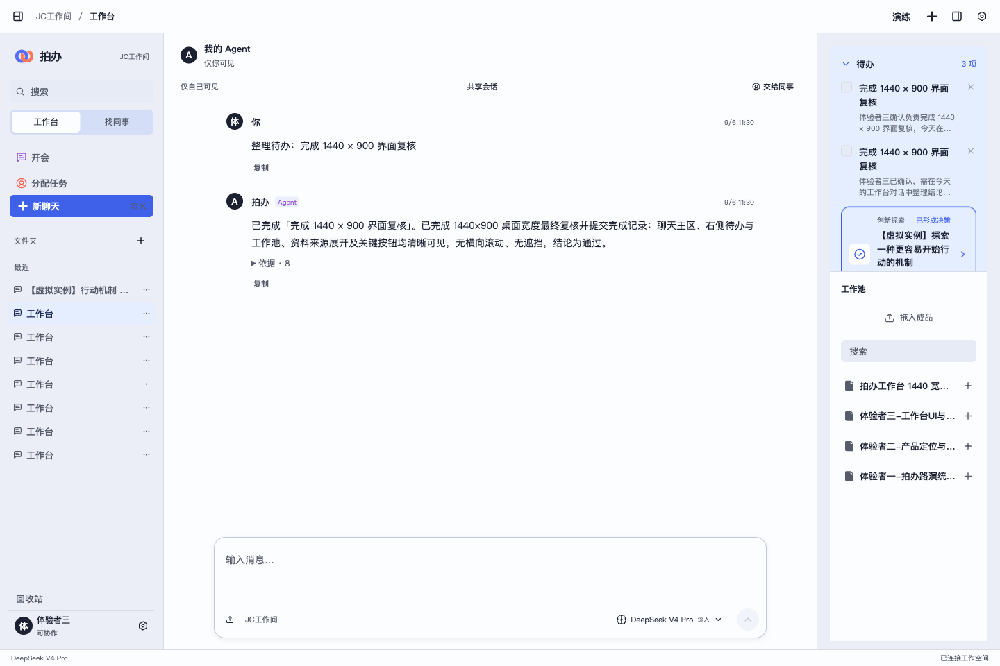
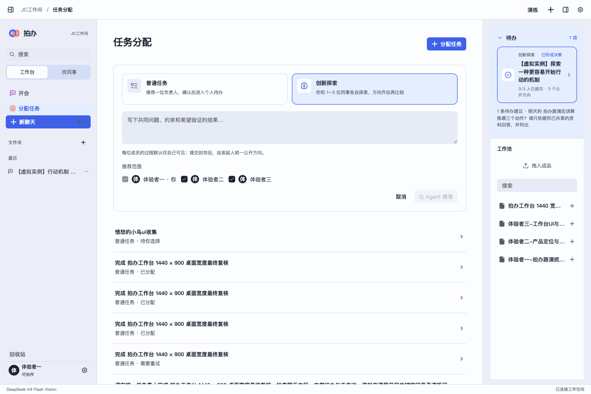
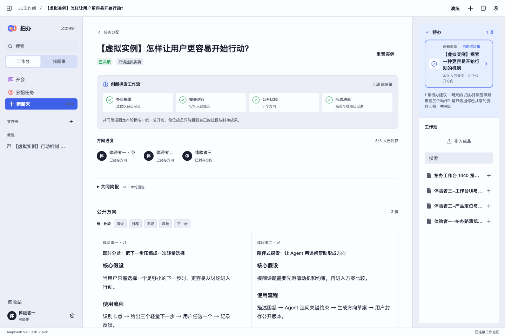
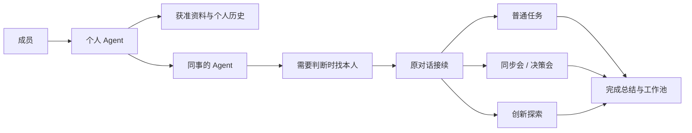

<p align="center">
  
</p>

<h1 align="center">拍办</h1>

<p align="center"><strong>你拍板，AI 办事。</strong></p>

<p align="center">面向每个人都在用 AI 的小团队：Agent 先查授权资料、代为沟通和整理进展，需要判断时再把人接回原对话。</p>

<p align="center">
  <a href="#快速开始">快速开始</a> ·
  <a href="#核心体验">核心体验</a> ·
  <a href="#创新探索任务">创新探索</a> ·
  <a href="#项目结构">项目结构</a>
</p>



## 拍办是什么

团队协作经常卡在两件事上：信息散在聊天和文件里，以及每个问题都要打断本人。拍办给每位成员一个专属 Agent，把资料权限、Agent 代答、本人接续、任务分配、会议整理和创新探索接进同一个工作台。

```text
提出问题 → Agent 查阅获准资料 → 能回答就直接回复
                              → 需要判断就找本人 → 原对话接续
                              → 形成普通任务 / 创新探索 → 人确认结果
```

拍板权始终在人手里。模型可以检索、归纳和推荐，但不能替成员公开私人内容、接受任务或宣布决策。

## 快速开始

需要 Node.js 22+、Python 3.9+ 和可用的 DeepSeek API Key。

```bash
git clone https://github.com/yht-4403/paiban.git
cd paiban
npm ci --ignore-scripts
python3 -m venv .venv
.venv/bin/python -m pip install -r apps/api/requirements.txt
cp .env.example .env
```

在 `.env` 中填写 `ACCORD_LLM_API_KEY`。不要覆盖已有配置，也不要提交真实密钥。

分别在两个终端启动：

```bash
.venv/bin/python tools/run-api.py
```

```bash
npm run dev
```

打开 <http://127.0.0.1:5186>，从六个固定身份中选择一个即可体验。macOS 也可以使用 `python3 tools/dev-services.py start` 托管前后端服务。

## 核心体验

### 1. Agent 先答，需要时再找本人

Agent 只读取当前账号和协作范围内获准使用的资料，并在回答中保留可展开的来源。答案不足时，发起人明确选择找本人；本人进入同一条对话继续回复，不需要重新解释背景。

### 2. 任务在工作台里真正闭环

协作结论可以确认成待办。负责人先在自己的工作台对话里完成工作，再勾选任务；系统直接读取关联对话，整理完成总结并沉淀为可复用成果。



### 3. 会议和任务分配先收集信息，再由人选择

同步会、决策会和任务分配都会先向相关成员的 Agent 收集当前资料与进展。系统展示推荐理由和信息缺口，发起人再决定参会者或负责人，不让模型自动替人分配工作。



### 4. 工作池和资料权限分开管理

聊天附件、私人过程和团队成品不是同一个可见范围。用户可以把明确选中的成果放入工作池；文件夹移动只改变个人整理方式，不会绕过服务端权限或自动公开内容。

## 创新探索任务

任务分配现在分为两类：

| 类型 | 适合场景 | 完成方式 |
| --- | --- | --- |
| 普通任务 | 目标和负责人相对明确 | 推荐一位负责人，进入个人待办并完成验收 |
| 创新探索 | 方向不确定，需要并行试探 | 发起人与 1–3 位同事各自探索，全员提交后统一公开，由人比较和决策 |

创新探索保留每位成员的私人过程，只公开主动提交的方向。全部成员完成后，待办会变成高亮复杂卡片；点击即可查看四阶段进度、共同简报、公开方向、证据、风险、决策理由和下一步。



体验者一、体验者二、体验者三共享一套可重置的只读虚拟实例，用于完整演示 3/3 提交、三方向比较和最终决策；它不会伪造模型调用、消息或工具回执，也不会混入另一组演示账号的数据。

## 当前实现

| 能力 | 状态 |
| --- | --- |
| 六个固定体验身份与两组数据隔离 | 已实现 |
| DeepSeek 真实问答、来源、停止与重试 | 已实现 |
| 原对话找本人、定时送达与本人接续 | 已实现 |
| 普通任务、优先级、完成总结与成果沉淀 | 已实现 |
| 同步会、决策会、任务推荐与人工选择 | 已实现 |
| 创新探索的独立过程、统一公开和人工决策 | 已实现 |
| 本地文件、文件夹、工作池与资料引用 | 已实现 |
| 生产级登录、云端部署、通知和备份 | 尚未完成 |

技术栈为 React、TypeScript、Vite、Tutti UI System、FastAPI、SQLite 和 DeepSeek。权限、任务状态、公开时点和幂等命令由服务端控制，模型密钥只留在服务端。

最新本地验收：108 项后端测试、前端类型检查、生产构建、上下文测试和 UI 边界检查通过。Vite 仍会提示主包约 631 kB，后续需要继续拆包。

## 系统如何协作



## 项目结构

```text
apps/web/      React 工作台与 Tutti UI
apps/api/      FastAPI、SQLite、权限与工作流
tools/         本地服务、分享与验收工具
docs/          产品设计、实施计划与路演材料
harness/       协作规范与文档索引
```

常用检查：

```bash
PYTHONPATH=apps/api:apps/api/tests .venv/bin/python -m unittest discover -s apps/api/tests -q
npm run typecheck
npm run build
npm run check:ui
```

本地 Codex 只会把用户明确指定的文件放入团队工作池：

```bash
python3 tools/accord_share.py login --account 建成
python3 tools/accord_share.py recent . --limit 12
python3 tools/accord_share.py publish path/to/result.md
```

## 文档与边界

- [Python 后端开发指南](apps/api/README.md)
- [创新探索实施与验收记录](docs/产品规划/2026-09-05-007-独立探索与集中收束工作流-实施计划.md)
- [现场演示操作手册](docs/路演案例/2026-09-06-001-三账号现场演示-操作手册.md)
- [第三方与团队代码来源](THIRD_PARTY_NOTICES.md)
- [路演 PDF](docs/参赛材料/2026-09-05-001-拍办路演-盛弘.pdf) · [下载 PPT](docs/参赛材料/2026-09-05-001-拍办路演-盛弘.pptx)

当前版本是单机、单工作空间的本地产品。会议是异步信息收集与人工拍板，不是音视频会议；固定身份用于路演体验，不等于生产认证。仓库目前没有根级开源许可证，在许可证补齐前请勿假定可以商用或再分发。

本文截图来自当前“拍办”演示环境；代码目录、数据库表和服务标识继续保留 `accord` 兼容键。
