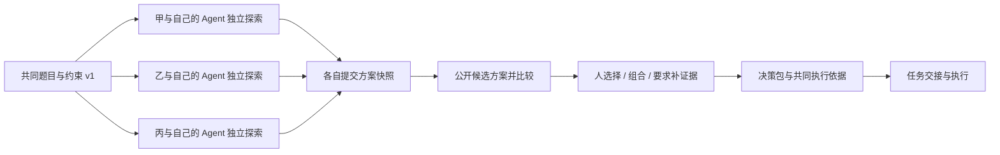

# 独立探索与集中收束工作流

> 2026-09-05，北京时间约 14:48。来源：JC 在本轮提供的会议转写文字、当前 Accord 工作区代码、既有产品与架构文档。没有取得原始音频，本文是会议意思整理与设计建议，不是逐字校订稿。代码正在其他任务中更新，以下技术现状是本次读取时的快照；未运行新一轮应用验收。

## 先回答：Accord 现在已经用什么

| 层 | 当前代码事实 | 证据位置 |
| --- | --- | --- |
| 前端 | React 19、TypeScript 5.8、Vite 6 | `apps/web/package.json` |
| UI 与样式 | `@tutti-os/ui-system@0.0.427`、Tailwind CSS 4；Markdown 阅读使用 react-markdown / remark-gfm | `apps/web/package.json`、`apps/web/src/styles.css` |
| 后端 | Python、FastAPI 0.128.8、Uvicorn 0.39.0 | `apps/api/requirements.txt`、`apps/api/accord_api/app.py` |
| 数据 | Python 标准库 sqlite3、SQLite WAL、本地文件目录 | `apps/api/accord_api/store.py` |
| 界面同步 | fetch 请求 HTTP API，页面可见时约每 1 秒轮询，Vite 代理 `/api` | `apps/web/src/app/App.tsx`、`apps/web/src/shared/api.ts`、`apps/web/vite.config.ts` |
| 模型调用 | httpx 0.28.1 调用兼容的 `/chat/completions` 流式接口，读取当前会话与共享资料 | `apps/api/accord_api/agent.py` |
| 后台运行 | SQLite 的 accord_runs 表 + API 进程内 Python 线程协调与执行；处理排队、停止、失败与定时转交 | `apps/api/accord_api/runtime.py` |
| 身份与业务 | 当前代码已含账号初始化、登录、邀请、Cookie 会话；协作转交、本人确认和待办状态校验 | `apps/api/accord_api/auth.py`、`apps/api/accord_api/app.py` |

前一条回复把 WebSocket 放进选型建议，不能据此说已接入。现在是后端向模型接收流式文本、逐步写库，前端通过轮询读取进展，两段传输要分清。已有后台执行器也是单 API 进程的线程方案；运行中的调用被重启打断后记为错误，由人重试，不是任意步骤的无损恢复。

此前 README / 004 验收描述的是更早的合成成员版本；当前代码已经出现真实账号和模型运行链路，正在 [006 真实工作空间与模型接入](2026-09-05-006-真实工作空间与模型接入-实施计划.md) 中推进。代码存在不等于该版本已部署、配置好供应商或通过真实多人验收。本文不读取密钥、账号数据，也不替代该任务的验收。

当前仍按一个部署对应一个团队工作空间；尚未实现本设计的探索轮次、个人分支、方案公开、汇总决策与受控的多 Agent 工作流。暂未引入 LangGraph、Redis/Celery、向量数据库或代码沙箱。

## 会议意思整理与判断

会议提出两类协作需求：

1. **项目交付**：目标和方案已有共识，上游交付可继续使用的成果，下游据此推进。关注版本、输入输出、依赖和承接。
2. **创新探索**：问题还没有确定解法，成员先各自探索，保留不同路线；到适当时点公开方案，再比较、组合或选择，形成共同执行依据。

JC 希望交付一套能直接使用的创新工作流：发起课题、独立探索、提交方案、集中比较、形成决策、接入执行。允许团队自行搭建工作流属于后续平台化方向；首版先验证这套成品体验。

“所有人从一开始共享全部探索过程可能让思路过早趋同”是本次设计动机，尚不是已验证的普遍结论。独立探索仍需要共享问题、约束和基础事实，避免成员解决不同问题。要控制的是探索过程与早期答案的公开时点。

转写中“前台 v 账号”“不工作抓起来”“hr 主动去问”等片段含义不明确。本文将其分别视为既有工具类比、发散期不共享过程、协调者/Agent 的主动提示这一可能解释，不将这些字样当作已决定的账号方案或 HR 角色。

## 设计简报与用户目标

平台：沿用 Accord 的桌面 Web 工作台和 Tutti UI。输出：可供产品、前后端协作的行为设计；本轮不修改应用功能，不接入工作流搭建器。

以下人物画像来自这次会议与既有团队材料，属于假设型，没有完成访谈聚类：

| 角色 | 行为与目标 | 设计取舍 |
| --- | --- | --- |
| 主要：参与探索的成员 | 与自己的 Agent 多轮研究、可能改方向；希望放心试错，提交时不丢依据 | 私人过程默认保留，整理和提交方便；持续可见当前公开范围 |
| 次要：发起者 / 主持人 | 给定问题、关注是否按时产出，最后组织取舍 | 看覆盖与进度，控制轮次；主持身份不自动解锁私人会话 |
| 购买者 / 团队负责人 | 希望少维护工具，在有限时间得到可执行方案 | 看完成质量与总协调成本；不以 Agent 数量作为价值 |
| 被影响者：方案接手执行的人 | 需要理解选择理由、责任和当前版本 | 决策包含证据、被否决选项与下一步，不只收到一段摘要 |
| 暂不优先：工作流平台管理员 | 希望搭建任意流程和复杂节点 | 首版不提供通用流程编辑器、任意自动化和权限配置矩阵 |

终点目标：获得若干有依据的候选方案，并作出可执行、可追溯的选择。体验目标：独立探索时有空间，公开时有掌控，收束时知道依据和下一步。

“为每个人新建项目”“移动文件夹”“手工拼上下文”是操作手段，可由产品消除。业务假设是这套预置流程能降低组织探索与收束的成本；技术要求是阶段可见范围、版本与恢复可靠。

## 当前状态与适用场景

当前 Accord 已有个人工作会话、找同事 Agent、显式找本人、确认产生待办和发布共享文本的代码路径。尚无课题与轮次对象；资料发布后进入团队共享资料集合，没有发散期和收束期的差别。

JC 描述通过多个项目/会话模拟独立探索，再拖到公共项目来共享。这是用户的操作类比；本轮没有验证 Codex / ChatGPT 的移动操作是否改变文件位置或自动载入目标项目全部内容，不能把该推断写成已确认的底层行为。

建议优先覆盖两个场景：

- **调研与方案探索**：同一问题分头调查，提交证据与备选方案，最后形成有理由的决策。
- **多路 MVP 验证**：围绕同一产品目标分别做小实验，提交可运行入口、观察结果和限制，再选下一步。原型“能跑”与假设“成立”分开记录。

故障排查、设计评审也可能复用，但先不扩为首版场景。已确定方案的日常交付继续走现有任务与成果流程，不强制每次都发散一次。

## 完整工作流



文字流程：共享问题 → 各自探索 → 提交可公开版本 → 统一公开 → 比较与决定 → 执行。候选方案公开后仍保留差异，不把互相矛盾的结论直接揉成一个“统一事实”。

| 阶段 | 人的动作 | Agent 的工作 | 可见范围与结束条件 |
| --- | --- | --- | --- |
| 发起 | 写题目、目标、约束、截止、参与者和评估维度 | 帮忙把模糊课题整理清楚 | 共同简报可见；主持人发布简报版本后开始 |
| 探索 | 在个人区域对话、研究、试验，可以开多个探索会话 | 辅助查证、追问假设、记录证据，不替别人定方向 | 默认只看本人过程；其他成员看进度，不能看答案 |
| 提交 | 检查并提交自己的方案卡 | 从本人选择的材料生成摘要和证据清单 | 提交版本进入待公开区；早提交不提前影响其他成员 |
| 收束 | 主持人结束探索并公开已提交方案；成员比较和追问 | 按相同维度比较、指出矛盾和缺证据处 | 只公开成员已同意分享的版本；缺交者可等待、延期或进入下一轮 |
| 决策 | 指定决策者确认采用、组合或暂缓，写理由 | 生成决策包及任务建议 | 形成版本化执行依据；任务仍由责任人确认承接 |

不用强制投票，更不由模型自行宣布“最佳方案”。可选择某案、组合多案或要求补实验；评价维度在探索前约定，变更要留下记录。

异步意味着成员不必同时在线。工作状态与截止存在服务端；参与者随时恢复自己的探索，主持人在条件满足时推进轮次。需要真人开会时，沿用会议提案与确认流程，不能默认每轮收束必须开会。

## 发散阶段如何避免过早影响与重复劳动

草案默认“只看进度，统一公开”。已向 JC 提出可见范围偏好问题；未收到回答前采用此设计假设，不将它写成用户最终决定。

| 模式 | 成员能看到什么 | 更适合什么 |
| --- | --- | --- |
| 独立探索（默认） | 共同简报、参与者、探索/已提交等状态 | 希望先得到独立判断，允许一定重复 |
| 方向避重（可选） | 在上述信息之外，看成员主动发布的方向标签 | 调研资源有限，需要减少重复搜索；接受部分相互影响 |
| 开放交流（可选） | 已明确公开的阶段方案与讨论 | 更重视共同构建，不以独立产出为目标 |

严格独立和完全避重不能同时保证。默认只共享进度；若要方向避重，用成员确认过的标签，不能让协调 Agent 偷读私人过程后以“有人正在做类似方向”间接泄露内容。

协调 Agent 的主动能力分层：对本人可提醒缺证据或截止；对团队只汇总获准状态与已发布标签；向真人发问题、建议换方向或拉会按可见规则和通知授权执行。不得自动挪走成员课题、强制换方向或把进度当绩效排名。

## 前端交互：一个课题下的探索与汇总

用课题组织工作，同一项目可以开多个课题；每个课题包含若干轮次，每轮每人有个人探索区。人员归属与项目结构分开，避免把“每个人”建模成互相独立的项目。

主工作区采用稳定的桌面工作台；个人探索是长时间使用的主界面，主持人进度面板是短时管理入口，后台提醒保持克制。

```text
Accord / 项目 / 课题：下一版的协作入口
阶段：独立探索      截止：今晚 18:00      已提交：2 / 4
可见范围：探索内容仅自己可见，提交后等待统一公开

左侧导航                 中间工作区                  右侧资料
共同简报                 我的探索会话                本轮目标与约束
我的探索                 与自己的 Agent 研究         本人选用的证据
团队进度                 可切换多个方向              我的方案草稿
候选方案（待公开）
决策与下一步             [整理成方案] [提交本轮]
```

收束后，中间区变成方案比较：问题理解、关键主张、证据、成本、风险、未验证假设、下一步实验。侧边保留来源预览；若存在冲突并排显示，而非悄悄覆盖。默认不按提交先后暗示优劣。

“整理成方案”从当前探索生成可编辑草稿；成员选取摘要、引用、附件或完整会话。共享完整会话是单独选择，且必须具备对其中材料的分享权。

### 拖动应表达什么

拖动作为快捷方式保留；主入口同时提供“提交方案”按钮，键盘和触屏用户无需依赖拖动。

| 动作 | 应有行为 |
| --- | --- |
| 调整个人列表顺序 | 只改变排列，不改变授权、资料归属或模型上下文 |
| 将方案卡拖到“本轮提交” | 打开提交预览，列出摘要、证据、附件和公开时点；点击“提交方案”才形成待公开快照 |
| 将整个会话拖到汇总区 | 先进入“整理为方案”，不默默共享完整历史；保留原会话 |
| 收束后把候选方案纳入决策 | 记录选中版本与理由，形成新执行依据；不把候选意见自动记成事实 |

提交预览直接显示后果，例如“将分享这份摘要和 2 个附件；原始探索会话保持私有；主持人开始收束后本轮成员可见”。这是必要的信息共享动作，不对普通拖动、排序重复弹确认。

个人原会话继续存在。汇总讨论创建新的会话，使用获准的方案快照与共同简报；默认不把汇总讨论反向塞进个人尚未结束的探索。

## 后端真正需要实现的行为

前端移动和上下文共享是不同操作。后端需要改变资源引用、可见范围与当前轮次的可用资料清单；不需要搬动用户文件夹，也不能通过修改 project_id 就跳过发布流程。

建议增加以下对象：

| 对象 | 最小字段与职责 |
| --- | --- |
| Topic / Round | project_id、共同简报版本、阶段、主持人、参与者、截止、可见模式、版本号 |
| Exploration | round_id、owner_id、关联会话、个人状态；会话保持独立 |
| ProposalVersion | 作者、内容、证据引用与版本、允许接收者、提交时间；版本不可原地覆盖 |
| Release | 哪一轮公开了哪些 ProposalVersion，谁操作、何时生效 |
| ContextManifest | 本次执行获准使用的简报/方案/资料版本清单与用途 |
| DecisionPackage | 采用的方案版本、被否决选项与理由、遗留问题、批准人、任务建议 |

轮次状态：draft → exploring → collecting → reviewing → decided → executing，另有 cancelled。方案状态：draft → submitted → released；撤回、替换用事件与新版本记录。阶段权限在服务端判定，不能只隐藏页面。

提交不立即公开：ProposalVersion 与发布授权同时保存；主持人只可发布作者已同意本轮公开的版本。公开前可撤回或替换；公开后撤回表示停止后续引用并保留撤回标记，无法保证别人忘掉已读内容。重新开启探索应新建轮次并标记已有信息暴露，不能宣称恢复到完全独立。

生成前构建上下文：探索会话只取得共同简报和本人明确选用的资料；汇总会话取得本轮 released 方案和允许访问的证据。模型按本次问题检索相关内容并保留来源，不是把整个项目的全部文本每次塞进 prompt。摘要也继承来源约束，不因被压缩就自动获得公开资格。

**当前代码需特别调整的点：** `app.py` 的 documents() 读取整个共享 artifacts 集合，`runtime.py` 会从该集合选资料。因此不能将发散期草稿或待公开方案直接写进现有共享 artifacts，再仅在前端隐藏。先建立 round/owner/release 的后端筛选，所有读取、模型上下文、导出和轮询返回都沿用该范围。

建议命令接口：POST /topics、POST /rounds/{id}/start、POST /explorations/{id}/submissions、POST /rounds/{id}/release、POST /rounds/{id}/decision。提交与发布携带 operation_id 和 expected_version，重试返回同一结果；公开快照与阶段变更在事务中完成。集体公开的生效状态先落库，再允许生成汇总，避免读到只公开一半的候选方案。

初期可沿用现有 HTTP 轮询，不因新增流程先换技术栈。API 只返回调用者可见的内容和运行状态。共同简报变更要产生新版本，提示哪些探索仍基于旧版本，不悄悄改写已提交方案的依据。

## 异常、恢复与验收

| 情况 | 应有反馈与恢复 |
| --- | --- |
| 无人提交 | 主持人看到真实空状态，可延期、补充简报或取消；Agent 不捏造方案 |
| 有人未提交但需要收束 | 明确显示缺交者；主持人选择等待或按已交内容推进，未交草稿仍不公开 |
| 网络断开或双击提交 | 本地保留草稿，服务端幂等返回同一提交；不能生成两份候选方案 |
| 提交后继续编辑 | 个人内容继续保存；已提交版本不静默变化，替换时显示新旧版本 |
| 附件无分享权 | 提交预览标出具体附件并允许移除，不自动扩大权限 |
| 多人同时结束探索 | 服务端版本校验，只产生一次公开事件；其他人获得当前状态 |
| Agent 汇总失败 | 原候选方案可继续阅读和人工比较；可重试，不阻塞人决定 |
| 证据冲突或信息不足 | 明确列出争议与缺口，允许请求补实验，不强行给出“最佳答案” |
| 已公开内容被撤回 | 提示影响到哪些后续结论；停止新引用，保留历史来源与撤回说明 |

验收至少覆盖：A 无法通过接口、资料搜索或模型间接读取 B 的未公开过程；A 提交后 C 仍不能提前看到；只有合法公开后所有参与者获取同一组方案版本；私人原会话仍在；拖动排序不扩大权限；刷新后阶段和提交保留；未确认的选择不会生成已承诺任务。

这些是待实现的验收标准。本轮仅核对源码与整理设计，没有执行这些功能测试。

## 第一版范围与产品价值

最小可用流程：主持人发布共同简报 → 两名成员各自探索 → 各提交一张方案卡 → 主持人公开 → 并排比较 → 记录决策与下一步。复用现有会话、模型、任务和 Tutti 组件；增加课题轮次、提交快照、公开规则与比较界面。现有真实账号和模型接入任务继续推进，本文不改变它的代码或已授权范围。

先用按钮跑通共享语义，再补拖动；自动避重、自由搭流程、全文件夹迁移、自动评分排名、常驻多 Agent 和自动开会不进入最小验收。每个人仍可在一个探索区内使用多个会话；增加真实多 Agent 委托时再接架构中的执行权限。

建议路演表达：**“Accord 让团队先各自探索，再带着证据一起决定，最后把决定交给明确的执行者。”** 是否比现有 Codex / GPT + 飞书组合更省事，需要比较准备时间、提交完整性、收束耗时、误共享和后续执行歧义；尚不能宣称独有技术或必然提高创新质量。

待定项：发散期可见模式、第二个优先场景、决策者与决策方式。现草案按独立探索、调研/多路 MVP、主持人确认决策处理；这些是可修改默认值。完整权限与多 Agent 执行背景见[技术架构设计](../技术架构/2026-09-05-001-多人多智能体协作架构-设计文档.md)，产品替代判断见[核心体验与替代方案](2026-09-05-005-核心体验与替代方案-设计文档.md)。
