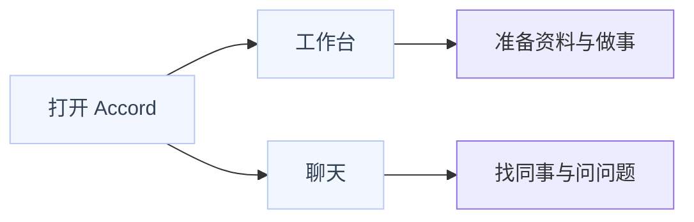
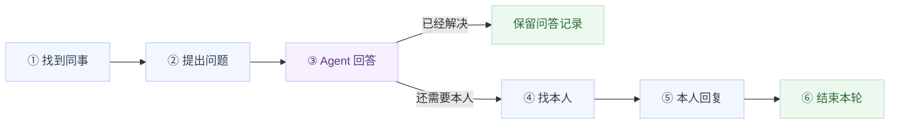
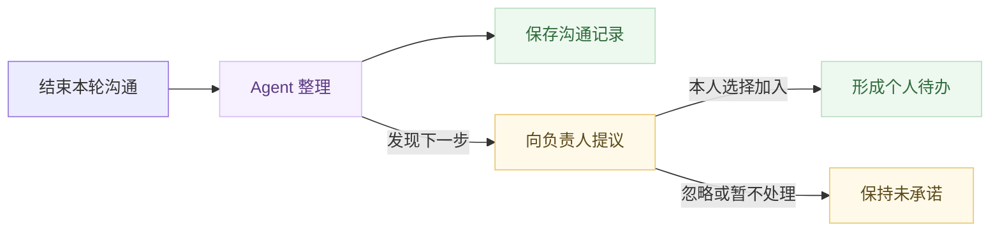
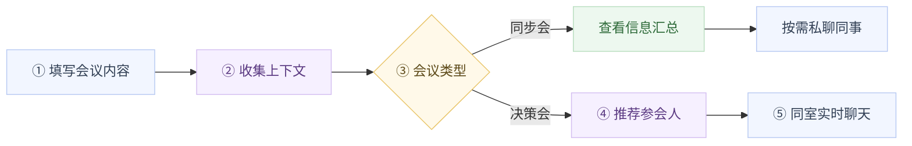
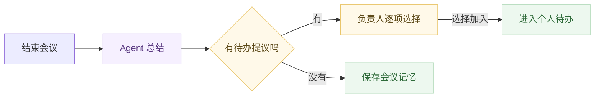
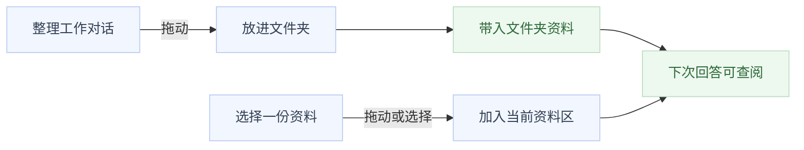

# Accord 用户体验与前端交互

## 2026-09-06 已确认：Agent 先完整回答，不做倒计时弹窗

JC 已明确确认 D4：当前协作事项中，Agent 必须先完整回答至少一次，之后才能找本人。完整表达“不知道”也算回答；不提供绕过首次回答的转交入口。

首次回答生成中、失败、被停止、为空或因输出上限截断，都不能解锁“找本人”；可以重试或继续提问。其他事项的历史答案不计入当前事项。当前仍有回答在生成时，保持等待结束后再转交。

JC 同时明确：不做倒计时接受弹窗，不因几秒未点击而自动接受、拒绝或拉人进聊天。D5 中其他紧急提醒方式仍待明确，不据此增加新的通知行为。

现有前端与转交接口已同时增加完整回答校验，转交流程继续使用原输入区。服务端根据实际模型运行成功记录及正常结束标记校验，页面状态不能绕过该规则；原有共享范围校验保持执行。

验证：52 项后端测试、类型检查、构建与 UI 规范检查通过。浏览器用隔离接口响应覆盖未提问、排队、生成、停止、失败、截断、其他事项答案及完整回答八类状态，并检查 1440 / 768 / 390 三种宽度和同窗转交。测试模型为可控替身，本轮未调用付费模型。主包约 530 KB 的构建提示仍在。

## 2026-09-05 会议讨论：注意力、加急与工作进度

讨论从“专注中 / 可协作能否自动判断”展开，最终涉及三个独立问题：人在做什么、事情有多急、资料是否定稿。把这三件事分别设计，才能减少打断和重复确认。

来源为 JC 提供的会议转写，未标注发言人。下文保留 9 月 5 日讨论，并标注 JC 于 9 月 6 日确认的结果；不将某位发言者的观点当作全体决议。9 月 5 日仅整理纪要和静态核对，9 月 6 日实现及验收见上节。

### 讨论中较一致的方向

- 产品内应能完成紧急找人，不能把打电话、微信或飞书作为默认解决路径。
- 对方忙不忙与发送者事情急不急分别判断。状态可以帮助理解背景，不宜单凭“专注中”就封死找本人路径。
- 保持一个聊天窗口。默认先问 Agent；不满意时携带本轮相关记录或摘要找本人，减少重复打字。共享范围仍须清楚。
- 发给 Agent 后可以离开做其他工作，回答完成后再回来看；不要求发起者一直守着页面。单纯问 Agent 默认不即时打扰被询问者。
- 过程信息应能持续共享，避免每次手动上传、逐文件判断完成程度。个人工作流中的确认与被同事临时叫来确认，要分别对待。
- 责任人仍需承担决策责任；应将确认放进自己的工作过程，减少同事反复追问和额外审批。

### 讨论中的分歧及确认结果

以下编号接续本文 D1–D3。D4 已确认；D5 已排除倒计时弹窗，其余提醒规则与 D6 仍待讨论。

| 编号 | 讨论的两面 | 当前能确定的边界 |
| --- | --- | --- |
| D4：能否在 AI 回完前找本人 | 曾讨论强制先答与提前转交两种方向 | JC 于 2026-09-06 确认：当前事项必须先有至少一次完整 Agent 回答，之后才能找本人；已落实前后端校验 |
| D5：加急如何提醒 | 曾提出 3–5 秒接受弹窗，也指出弹出本身就打断 | JC 于 2026-09-06 明确不做倒计时弹窗；提醒强度、专注期规则和无人回应后的处理方式仍待确定 |
| D6：谁确认资料可当作结论 | 希望共享进行中的工作，又担心队友将 AI 产出当作本人决定；有人主张责任人确认，有人反对逐文件维护 | 系统可记录生成、修改与完成动作；这些动作是否代表本人采用，需要明确，不能由 AI 猜测 |

关于集中处理，讨论提出专注时段、统一汇总时段及集中会上同步；未确定每天、每周的频率，也未确定它们如何满足事项截止时间。不要把提及的分钟数、周频率或模型等待时间写成固定产品参数。

### 对前端交互的整理建议

以下为基于讨论提出的建议；D4 的完整回答限制已于 9 月 6 日实现，其他新增行为仍供后续迭代评审。

| 用户场景 | 建议界面行为 |
| --- | --- |
| 查看同事状态 | 头像旁短标签；有可靠事件才显示正在聊天、开会等，无依据时显示未知或最近活动。专注偏好单独设置，不用闲置时长推断心理状态 |
| 问 Agent | 同一输入框发送，列表显示生成进度；完成后向发起者显示未读标记。被询问者可在自己集中处理时看摘要，避免每次查询都推送 |
| 需要本人 | 当前事项先取得至少一次完整 Agent 回答，再在同窗转交；生成期间不可转交。“加急 / 截止前处理”仍需后续实现 |
| 非紧急通知 | 显示“几点前需处理”，按接收者的集中处理安排归集；不能把截止时刻当成首次送达时刻，也不能承诺对方届时必然回复 |
| 紧急找人 | 进入产品内可追踪的请求，区分已送达、已读、已回复；通知方式由 D5 继续收敛，不做倒计时抢答弹窗 |
| 查看工作进度 | 显示进行中的材料、依据及更新时间；可见性、是否完成和是否已确认分别表达，避免一个“共享”标签承担三种含义 |

主线：发消息 → Agent 处理，发起者可离开 → 完整回答后回来查看 → 已解决则结束；仍需本人则在同窗转交 → 本人处理。D4 已确认，加急也不绕过首次完整回答；D5 继续明确完整回答后的紧急提醒方式。

### 如何减少资料维护，又不让 AI 冒充拍板？

建议在用户已授权共享的工作范围内自动记录进展，按实际事件区分“生成完成”“测试通过”“本人采用”“对外发布”。未知就保留未知，不能因为文件存在、AI 说完成或十分钟未修改，就标成已定稿。

责任人在自己的工作流中采用某个结论时，只确认该结论及关联版本，不要求每份过程文件都手动打标签。Agent 回答同时带来源、时间和确认状态；未确认材料可以帮助了解进展，不能被表述成负责人的承诺。已确认版本与后续修改分开记录，新内容不自动继承旧确认。

上述方案仍需明确哪些工作动作可作为确认依据。自动共享也只发生在既定授权范围内，不等于默认公开全部私人工作台。

### 当前代码和这次讨论差在哪里？

以下为 2026-09-05 的源码快照；其中停止后可转交的旧行为已在 9 月 6 日修正，当前规则与验收以上节为准。

- 当前 [状态逻辑](../../apps/api/accord_api/activity.py) 由本人设置专注偏好，并在本人开启后显示 Accord 站内活动；会议状态未接入，不判断思考、全系统活动或真实空闲。
- 当前 [找本人界面](../../apps/web/src/features/workspace/ConversationInput.tsx) 在模型生成时禁用找本人；[转交接口](../../apps/api/accord_api/app.py) 同样要求先停止或等待完成。它并不要求必须有一条完整 AI 答案，与讨论中“Agent 一定先回复”的主张也不完全相同。
- 当前“立即 / 定时”表达送达时刻；接口字段虽叫 deadline，实际是到点送达。它不是“请在这个时间之前处理”，也没有紧急通知、周期汇总和完整已读回执机制。
- 已有资料版本和引用校验；自动采集工作过程、判断结论确认状态及据此代答，仍待设计与实现。模型检索和响应速度仍需优化，完整回答要求不替代性能改进。

## 2026-09-05 群聊与消息视觉层级已接入

参考 JC 提供的飞书和 Grok Bot 截图，把协作界面改成以消息为主的聊天。以下是实际运行能力；下方早期界面稿与验收保留阶段记录。

| 用户要做什么 | 入口与反馈 |
| --- | --- |
| 拉群 | 协作列表旁点加号，选择至少两位同事后建群；当前每群共 3–8 人 |
| 群内聊天 | 同一个输入框直接发消息；刷新后保留群与消息 |
| 请 Agent 回答 | 输入 @ 或点 @，选择某位成员的 Agent；仅本次发送调用该 Agent，回复带身份与资料引用 |
| 邀请更多成员 | 群主在成员栏点加号；新成员只看加入后的消息 |
| 改群名 | 群主在成员栏就地修改；手机点群名下的人数打开成员列表 |

消息正文优先：自己靠右、同事靠左；短消息按内容收窄，长消息限制宽度。姓名、时间和系统事件降一级，Agent 用小标签区分；复制操作悬停或聚焦才出现，触屏保留入口。已完成任务降低强调，未改变原有任务业务流程。

群聊输入框收成一行，选中的 Agent 作为可移除标签。保持 Tutti 的组件、图标与语义配色，选中、悬停、按下和键盘焦点沿用同一套规则。

权限由服务端执行：建群不带入私聊，非成员不能访问，邀请和改名仅群主可做。Agent 只读取所有群成员都获准查看的资料和共同可见的历史；新成员加入后，旧历史也不会被 Agent 转述给新成员。普通群消息不触发模型或自动创建任务。

验收：50 项后端测试、类型检查、生产构建、UI 规范检查通过。隔离账号完成建群、多方发消息、邀请、改名、刷新持久化与历史隔离；真实 DeepSeek V4 Pro 调用查阅共享资料并返回引用。已检查亮暗色、1440 / 768 / 390 三种宽度、短气泡、圆形头像和手机成员入口。截图仅含隔离测试数据。构建主包约 529 KB，仍有体积提示。

当前支持文字群聊与显式 @ Agent；移出成员、退群、解散、群文件上传、音视频会议和多个 Agent 自动轮流讨论尚未实现。

## 2026-09-05 个人空间与自动资料检索已接入

本节为本轮实际实现；下方既有界面稿保留为历史设计，入口名称以本节和运行代码为准。当前入口改为“个人空间 / 协作”；右侧资料树可筛选、展开、查看、点击指定或拖入输入区，新聊天指定资料会保留未发送草稿。

普通聊天未指定资料或文件夹时，AI 可检索本次获准目录，正文由工具按需读取；指定文件或文件夹后缩小范围，空文件夹保持空范围。移除资料后发起的新回答会排除该资料，可重新指定恢复；已经生成中的回答继续使用冻结范围，撤回访问权限则会停止读取。对话自身的历史继续保留，移除资料不等于清除已经生成的回答。

自动目录最多 200 份且元数据不超过 24000 字符，超出时要求指定资料。现阶段是有界的关键词检索，不宣称向量检索或全盘搜索。版本在发送时固定，工具调用与回答过程继续校验授权。课题等专门工作流保持原有固定范围。

个人普通聊天可“删除聊天”，进入回收站；可撤销、恢复，不加确认弹窗，不永久删除记录。正在生成的回答须先停止；协作聊天和课题聊天不适用。聊天原有资料绑定仍保留，回收站不改变资料共享权限。

资料树只是 Accord 中获准资料的导航，同事资料按所有者分组。群聊已支持多人消息和显式 @ Agent；共享文件夹权限继承与外部文件同步仍未实现。浏览器活动不代表操作系统或日历活动，保持已有状态共享选择。

验收：46 项后端测试及类型、构建、UI 检查通过；隔离浏览器验证资料拖动、草稿保留、删除/撤销/恢复及 1440、768、390 三种屏宽。测试图片未含真实成员数据。主包约 522 KB 的构建提示仍在。

后续部署、开放接口与收费方向见 [开放记忆与协作平台路演说明](../参赛材料/2026-09-05-002-开放记忆与协作平台-路演说明.md)。

用户只需要记住：自己的工作去「工作台」，找同事去「聊天」。找到一个人后，Agent 先回答，需要时本人在同一个窗口接上。

> 读者：JC、产品设计与前端队友。目的：先通过流程图理解聊天、会议、任务分配，再核对界面动作。来源：2026-09-05 本轮需求与同事反馈，以及当日 Accord 源码检查。下文是目标方案；已实现范围见文末。本文记录目标设计；界面稿检查与本轮前端减法验证见下文，不代表完整业务验收。

## 界面减法：只留内容、状态和动作

产品页面只保留标题、实际内容和当下可执行的动作。介绍产品怎么工作的段落移出日常界面；消息正文、会议结论和任务内容不因精简界面而删减。

| 原界面文案 | 精简后 |
| --- | --- |
| 今天，先推进哪件事？＋下面的介绍段 | 工作台 |
| 请某某本人接入 | 找本人 |
| 确认下一步并由我负责 | 承接任务 |
| 这件事，交给谁来推进？ | 选择负责人 |
| 每位候选重复说明适合做什么 | 一行职责＋依据入口＋分配 |
| 输入框下常驻草稿与键盘说明 | 删除；快捷键留在发送按钮提示中 |

颜色按作用统一：主操作使用 Tutti 实色按钮；同级候选同等强调；普通操作透明，悬停用浅底，按下用更深的浅底；选中项保留浅底与勾选或标签；键盘焦点保留清楚轮廓。成功、等待、错误沿用绿色、黄色、红色状态 Token，并附短文字，避免只靠颜色理解状态。

添加、关闭、展开使用图标并保留可访问名称；找本人、承接、分配保留短文字。接收人、共享消息范围、定时送达和错误不能因减字而隐藏。Agent 与本人通过头像、姓名、身份标记区分，正文边框保持中性。

本轮已改正式前端的工作台、联系人、待处理、待办、输入区文案与点击反馈；未增加业务接口。类型检查、构建、UI 规范检查通过，构建仍提示主包超过 500 kB。使用隔离数据和两位验收账号验证了原位转交、取消保留草稿、转交隔离、本人承接与完成，以及 1440 / 768 / 390 宽度下五类页面无横向溢出。该环境没有连接模型，截图中的模型未配置提示是真实错误；本轮未重新验证 AI 调用。

## 先看具体界面，再看下面的流程

这份可点击界面稿面向 JC 和产品、前端队友，用于审阅页面布局和操作状态。沿用 Tutti UI System 的组件、图标和语义配色。角色名与对话内容用于界面审阅，交互只改变本地状态；界面稿没有接入 AI、发送消息或创建实际会议、任务；正式前端本轮完成文案与点击状态精简，会议与任务推荐仍为设计。

打开方式：JC 本机访问 `http://127.0.0.1:5194/`；飞书附件「Accord界面与交互设计.html」下载后可离线打开。上方是设计审阅工具，可选择工作台、聊天、会议、任务及不同状态；右上角可查看布局说明、切换明暗主题。实际产品框内只保留当前工作需要的操作。

| 页面 | 看哪里 | 直接怎么操作 |
| --- | --- | --- |
| 工作台 | 左边文件夹，中间继续推进，底部主输入框 | 点击开会或分配任务；拖动工作对话切换文件夹 |
| 联系人聊天 | 左边联系人，顶部接待身份，底部同一个输入区 | 找本人 → 就地编辑转交内容 → 发送给本人 → 本人接续 → 结束整理 |
| 开会 | 中间议题与会前简报，下面参会人 | 同步会直接看汇总、私聊；决策会增减名单后邀请参会 |
| 分配任务 | 上面任务与资料，下面一至三位建议负责人 | 查看依据 → 选择一位 → 分配后显示来源和待处理状态 |
| 资料与参与者 | 右侧按需展开的资料栏 | 点击资料引用；查看当前范围；共享内容就地确认 |

### 工作台：先看到事情，再决定怎么推进

保留两个主入口「工作台 / 聊天」。工作台用文件夹组织个人工作；「开会」「分配任务」进入当前内容区。中间不堆统计大屏，主要展示待推进的工作与下一步入口。

### 聊天：点找本人，输入区原位展开

联系人和历史记录保持原位。转交卡明确发给谁、带什么，允许修改后发送；取消会恢复原草稿。进入等待本人后使用独立输入草稿，未发送的私人草稿不会被带给同事。Agent 与本人用头像、名称和身份标签共同区分。

### 会议：简报在上，参会名单在下

同步会的信息汇总与决策会的参会推荐在同一区域查看。名单直接点击加入或移除，关键决策人有明确推荐理由。邀请、会议室和会后整理沿当前页面接续；会议后的待办建议仍由对应负责人确认。

### 任务：选中负责人，就完成分配

任务描述与资料固定在候选名单上方，每位候选只呈现必要依据和分配按钮。直接分配后进入对方待办，显示「JC 分配 · 待处理」；不把分配写成对方已承诺，也不追加一轮接单确认。

### 资料：按需展开，切换上下文不清空聊天

桌面默认收起右栏；点击资料或顶栏图标展开。引用与共享分开操作，移动文件夹只调整工作归属和后续资料范围，不自动扩大历史消息的可见范围。手机版导航按需展开，资料栏在内容上方展开，避免遮住输入框。

界面稿已验证：连续输入与焦点、取消转交保留草稿、转交不携带私人草稿、参会人增减、待办建议加入、直接分配来源，以及 1440 / 768 / 390 像素宽度下四类页面无横向溢出。另检查明暗主题和离线运行；这属于界面稿验证，不代表真实业务链路已验收。

## 打开 Accord 后，我先去哪里？

处理自己的事进入工作台，找人沟通进入聊天；两个入口共用已有资料和待办。

| 入口 | 左侧放什么 | 中间做什么 |
| --- | --- | --- |
| 工作台 | 文件夹、自己的工作对话 | 和自己的 Agent 做事、查看资料、处理待办 |
| 聊天 | 联系人、最近联系与未读 | 和某位同事的 Agent 或本人沟通 |

会议和任务分配各有明确入口。布局建议：在工作台放「开会」「分配任务」，点击后在当前内容区展开；联系人聊天仍集中在聊天入口。

「导入 / 连接 Agent」放在首次设置，资料来源之后可以调整。每次找同事直接进入聊天。没有接入资料时如实显示可用范围，不让用户等待一轮假检索。

每个联系人保留一个聊天入口，里面可以有多轮沟通。工作台、聊天之间切换时，保留各自的草稿和阅读位置；手机上先看列表，点进去看对话，返回后回到原位置。

## 找一位同事，完整体验是什么？

先问对方的 Agent，仍需本人时原地转接；双方始终看同一个联系人聊天。

1. **我点开同事。** 顶部是同事的名字和允许共享的状态，输入框标明当前由谁接待。
2. **我直接问问题。** 对方 Agent 用获准资料先回答，答案旁可展开资料来源；涉及承诺、分工时等本人判断。
3. **我点击「找本人」。** 原输入区展开一张待发送卡，显示接收人、本次问题和将带上的内容；可以编辑后「发送给本人」，也可以收起。这里不另开聊天窗。
4. **同事看到请求。** 在联系人列表看到未处理提示，打开后看得到这次问题、转交内容和引用资料，不必让我重新解释。回复第一条消息即可接上。
5. **我们继续聊。** 对方本人开始回复后，Agent 暂停自动代答。任一方可以「结束本次沟通」。

Agent 已经回答清楚时，用户可以直接离开。无需找本人、填写结论或创建待办。

## 聊天页面怎么变，才不会让人困惑？

联系人、消息区和主输入框位置固定，变化集中在身份提示、当下动作和消息内卡片。

| 当前情形 | 页面让用户看到什么 | 主输入框与动作 |
| --- | --- | --- |
| Agent 接待 | 「同事的 Agent」；本轮私人询问的可见范围 | 正常输入；可以「找本人」 |
| Agent 正在回答 | 在回答位置显示真实生成或查阅状态 | 可以写草稿、停止生成；停止完成后才能转接 |
| 准备转交 | 输入区内显示接收人和待发内容 | 「发送给本人」；收起后恢复原草稿 |
| 等待本人 | 「等待本人回复」；已发内容留在原处 | 可补充消息；消息明确发给本人，Agent 不抢答 |
| 本人接上 | 本人头像、姓名；一条轻量接入提示 | 继续输入；「结束本次沟通」 |
| 本轮结束 | 消息间一条结束分隔；原位整理结果 | 建议恢复 Agent 接待；旧记录仍可查看 |
| 待办待确认 | 消息中的待办卡；负责人清楚可见 | 负责人可「加入我的待办」、编辑、忽略 |

前端遵循四条规则：

- **身份一眼可见。** 头像、姓名和「Agent」文字共同区分来源，颜色只辅助；沿用 Tutti 的组件与语义色。
- **只出现当前需要的动作。** 定时发送放在转交卡的次级选项，任务操作放在任务卡，资料详情按需展开。
- **草稿不会自己换收件人。** 找本人、取消转交、自动结束，都不能把未发草稿悄悄改成发给另一方；切换前保留原草稿。
- **新消息不打断阅读。** 读旧记录时显示「有新消息」，点击才回到底部；切换联系人后各自恢复位置。

断网时在未发送的消息旁提供重试，保留原文，不展示「已发送」。多次点击不能重复发请求、建待办。状态在另一台设备变化时先更新身份与按钮，阻止按旧状态提交。

## 聊完以后，哪些事情自动发生？

真人沟通可以由任一方结束；双方 30 分钟没有新消息时自动结束，随后 Agent 整理本轮内容。

上图采用本轮建议：记录与待办并行。一次沟通既可以留下结论，也可以产生待办；待办被忽略后，原始沟通仍能回顾。

| 结果 | 用户看到什么 | 保存到哪里 |
| --- | --- | --- |
| 沟通记录 | 「本次沟通已结束」，结论按需展开；可回到原消息 | 本轮可见的会话记忆，保留来源 |
| 待办提议 | 每条一张简短卡片，包含事项、负责人；有明确约定才填写期限 | 先留在本轮；负责人接受后进入自己的工作台 |
| 没有新待办 | 只保留记录，不增加通知 | 保持原有待办不变 |
| 整理失败 | 「整理未完成 · 重试」 | 聊天记录保留，不显示虚假的保存成功 |

每个人确认自己的事项，不用由一人代全体接受。负责人不明确时，保留为本轮待认领项，不推送给猜测出来的人。忽略提议不改原话；关闭沟通不代表任务完成。协作中已经接受过的待办不重复提议。

计时建议从最后一条被服务端接收的真人消息开始；等待首次回复的阶段不使用这条闲置规则。正在输入、页面在线、Agent 整理都不算新消息。结束和新消息恰好同时到达时，界面保留草稿并按最新状态提示，不能丢消息或重复整理。

结束后建议恢复 Agent 接待，再次发送就是新一轮。输入框先显示当前接待者；上一轮待办继续保留，下一轮私人询问拥有自己的可见范围。

## 点击「开会」后，会经历什么？

先写清要同步或决定的事情，值班 Agent 收集获准信息；同步会交付汇总，决策会再邀请需要拍板的人进入房间。

| 用户走到哪一步 | 页面如何变化 | 用户需要做什么 |
| --- | --- | --- |
| 发起会议 | 当前区域出现议题输入框，资料可拖入 | 写清楚这次要了解或决定什么，开始收集 |
| 值班 Agent 收集 | 同一张会议卡显示相关人员的「收集中 / 已提供 / 待补充 / 无权读取」 | 可以继续补充议题；不用逐个打开个人 Agent |
| 判断会议类型 | 展示「同步会 / 决策会」；建议类型可以原位切换 | 确认这次只需了解情况，还是需要人作决定 |
| 同步会收束 | 原位展示汇总、来源、更新时间与未解决问题 | 阅读即可；需要追问时点人员头像进入已有私聊 |
| 决策会准备 | 先展示汇总，再展示推荐参会人的头像和简短理由 | 可增减名单，点击「邀请参会」 |
| 人员进入房间 | 显示「已加入 / 等待加入」及共享消息区 | 点「加入会议」后用同一个输入框实时聊天 |

同步会无需创建真人房间。汇总默认先交给发起人，不自动向全体广播。有人未提供信息、查询失败或没有权限时，保留缺口；只有实际齐备才能显示「同步完成」。发起人可以带着这些缺口继续找人单聊。

决策会的参会顺序：**关键决策人优先；补上与议题有关、尚未提供信息或进度未知的人；已提供信息且无需参与决策的人可以不参加。** 关键决策人即使已经提供资料，也应保留。值班 Agent 负责整理依据和缺口，决定由真人作出。

房间内建议固定三处：顶部为议题与参会人，中间为实时消息，侧边按需展开会前简报和资料。值班 Agent 按需协助整理，不在每条真人消息后插话。主持人结束会议；个人离开可以返回，离开页面不等于结束整个会议。这是房间交互建议，多人会议的自动结束规则另行确定。

会后按本次需求分流：有待办先询问负责人，无待办则把本次上下文写入获准的会议记忆。

总结与待办卡都留在会议记录中，负责人可直接「加入我的待办」、编辑或忽略。没有新待办时安静保存；保存失败则原位提示重试。聊天记录持续保留；有待办或所有提议都被忽略时，摘要何时自动进入知识库仍见 D2，不能与原始消息存档混为一件事。

「直白 Agent」在本文按「值班 Agent」理解。会议记忆作为它后续查阅的上下文之一，保留来源、时间和可见范围；未确认的总结保持草稿标识，不自动成为所有人已同意的决议。

收集前先明确项目与议题范围，各个人 Agent 只提供能向当前受众披露的信息。推荐名单变化后再次检查房间简报和引用资料，不能因拉入一个新人而顺带公开私人资料。邀请已发送、本人已加入、本人在发言分别显示；缺席者不能被标为同意结论。

## 如何把一件任务分给合适的人？

发起人写任务，Agent 推荐 1–3 位人选；发起人最后选择，任务直接进入所选负责人的个人待办。

| 用户动作 | 前端交互 | 实际结果 |
| --- | --- | --- |
| 点击「分配任务」 | 当前区域展开任务输入和资料区 | 填写具体要做的事、相关上下文；期限与优先级按需设置 |
| 请求推荐 | 输入内容保留，下面展示候选卡 | Agent 从获准的个人 Agent 上下文、记忆与工作信息中寻找人选 |
| 查看 1–3 位候选 | 每张卡显示头像、名字、简短理由；依据按需展开 | 推荐有据可查，不显示猜测的能力分数、工作量或完成承诺 |
| 选定负责人 | 在候选卡点击「分配给此人」，按钮显示提交中 | 这次点击就是最终选择；页面不再弹二次确认框 |
| 分配成功 | 原位出现任务卡，可查看或联系负责人 | 任务进入对方个人待办，标明分配人和来源 |

选择前应能看见将发给对方的任务正文、资料范围、期限和优先级。这里默认每项任务选择一位负责人；一次推荐三个人，不代表给三个人各派一份。没有足够依据时如实提示，允许发起人手动选择有分配权限的成员，不为凑满人数编造推荐。

**主动分配与 Agent 提议采用不同规则：**

| 任务从哪里来 | 谁决定加入待办 | 卡片如何标识 |
| --- | --- | --- |
| 发起人主动分配 | 有权限的发起人选定后直接加入 | 「由某位同事分配 · 待处理」 |
| 聊天或会议中 Agent 提议 | 负责人选择加入后才进入正式待办 | 加入前「待确认」；加入后「本人已确认」 |

主动分配进入待办，不额外要求负责人再确认一次才能看见；它也不代表负责人已经承诺完成期限。负责人可从任务卡联系分配人；退回、改派和多人分工属于后续交互补充，不能假装已有。

点击推荐人本身不会让 Agent 获得派单权，实际任务写入以发起人的分配操作为准。失败时保留任务内容和选择，重试不重复创建；分配成功以服务端返回为准。直接分配的角色与项目范围见 D3，普通查看权限不能自动变成派单权限。

## 文件夹和资料，怎么自然地接进来？

文件夹帮助整理工作；把资料放进当前对话，Agent 才在下一次回答时按权限使用它。

| 我做什么 | 界面反馈 | 实际含义 |
| --- | --- | --- |
| 把自己的工作对话拖进文件夹 | 文件夹高亮，放下后更新位置，可撤销 | 原聊天和记录保留，位置变化本身不新增读者 |
| 把资料或资料集合加进当前对话 | 出现资料标签；展开可看来源与范围 | 持续引用，Agent 按需查阅获准内容 |
| 切换文件夹或增减资料 | 资料区更新，正在回答时标明「下次生效」 | 当前回答不在中途偷换依据；撤权立即限制后续读取 |
| 移除资料标签 | 标签消失 | 停止后续引用，原文件及历史消息保留 |
| 把同事拖到协作位置 | 原位出现带接收人头像的共享卡 | 选取内容后明确发送；不会自动公开私人历史 |

拖动操作同时提供「移动到」「添加资料」菜单，兼容手机、键盘和不习惯拖动的人。联系人聊天仍按人归并；可在自己的文件夹保存关联入口，个人整理位置不改变对方的联系人列表。

## 能看到同事正在做什么，到哪里为止？

默认展示本人允许共享的状态；看到状态不会自动获得私人聊天内容。

| 想知道什么 | 前端如何表达 |
| --- | --- |
| 现在方便联系吗 | 联系人旁显示本人设置的「可协作 / 专注中」 |
| 是否正在使用 Accord | 本人开启后显示「在 Accord 工作 / 聊天」；信号过期就撤掉实时活动描述 |
| 正在处理什么 | 本人允许后显示获准事项标题；可展开有权查看的工作 |
| 进度和优先级 | 展示双方可见待办的状态、优先级；不生成猜测的完成百分比 |
| 是否正在开会 | 接入可靠会议来源后再显示；目前不能靠在线状态推断 |
| 能否读同事的聊天 | 查看双方共享的本轮内容，或对方明确分享的片段；其它私人聊天保持原范围 |

状态开关集中在个人设置，日常聊天无需重复授权。聊天顶部的参与者和资料标签让当前范围随时可见。自动整理继承本轮范围；发布成团队知识是另外一次明确共享。模型提议与本人已确认的承诺保持不同标识。

## 现在做到哪里，还需要调整什么？

现有代码已具备同事聊天入口和原窗口转接；完整的「结束 → 整理 → 再接待」闭环仍待开发。

| 2026-09-05 核对范围 | 状态 |
| --- | --- |
| 工作台与聊天分入口、同事历史归并、Agent 先答、原输入区转交与本人回复 | 已在当前源码中实现 |
| 负责人确认待办、设置优先级与完成状态；个人文件夹、持续资料引用 | 已在当前源码中实现 |
| 本人开启站内状态与事项标题、过滤无权读取的记录 | 已在当前源码中实现；会议未接入 |
| 任一方独立结束本轮、30 分钟自动结束、结束后 Agent 再接待 | 尚未实现；需要独立的沟通轮次 |
| 自动整理会话记忆、多负责人待办提议与分别接受 | 尚未实现；现有「确认下一步」仍同时创建任务并改变协作状态 |
| 任意本地目录、外部 Agent 导入、飞书实时资料与会议来源 | 尚未形成完整接入；当前资料导入以 Markdown / 文本为主 |
| 完整未读、通知与已读体验 | 本文描述目标；现有实现不足以视为完整交付 |
| 值班 Agent 向个人 Agent 收集、同步会汇总、决策会选人与实时房间、会后记忆 | 目标流程，当前新版未形成可用闭环；遗留会议存储函数不等于新版会议模块已接通 |
| 推荐 1–3 人、发起人直接分配到对方待办 | 新明确的需求，尚未实现；现有确认接口只允许负责人本人创建待办 |

已明确的需求：工作台与聊天分入口、一人一个聊天、同窗转接；单聊任一方可结束，半小时无消息结束；同步会先汇总，决策会再找关键人员；无待办的会议上下文进入值班 Agent 可查阅的记忆；主动分配由发起人选人后直接入待办，聊天与会后提议由负责人选择加入。

仍需评审：**D1**，单聊结束后默认恢复 Agent 接待，以及等待首次回复不计入半小时；**D2**，有待办或所有提议被忽略时，会后摘要自动入库的时点，建议与待办确认并行、保持原可见范围；**D3**，哪些角色可以在什么项目范围内直接给别人分配任务。这些事项影响沟通轮次、记忆及权限，本文未将其写成已冻结的接口契约。

与现有实现的关键差异：任务列表当前统一显示「本人已确认」，新直接分配任务必须按来源显示「由同事分配」；会议结束权限不能直接套用双人聊天的任一方结束。上述变化仅作为设计记录，不表示本轮已修改代码。

验证这套体验时，优先看四件事：Agent 答清楚能否直接离开；本人能否不重复询问背景就接上；没有任务能否正常结束；新一轮私人询问是否保持正确范围。看懂流程后再细化实现，不增加独立审批页面。

产品细节参见 [状态与权限设计](2026-09-05-008-团队工作状态与可见权限-设计文档.md)、[文件夹与上下文设计](2026-09-05-010-会话拖放与模块化上下文-设计文档.md)。历史实测参见 [协作工作区联合验收](2026-09-05-010-会话拖放与模块化上下文-验收记录.md)，其中 42 项测试是该次验收记录，本文未重复运行。

本轮源码依据：[同人聊天入口](../../apps/api/accord_api/chats.py)、[转接与确认](../../apps/api/accord_api/app.py)、[主输入区](../../apps/web/src/features/workspace/ConversationInput.tsx)、[本人控制的状态](../../apps/api/accord_api/activity.py)。本地采集的后续边界另见 [AI Memory 接入设计](../技术架构/2026-09-05-004-AIMemory接入与协作记忆平台-设计文档.md)，该文档不代表已经完成接入。
