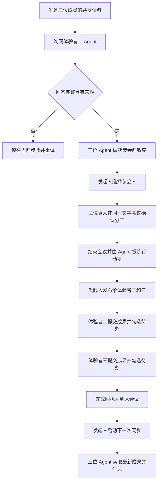

# Accord 体验账号教学演练设计

> 本地来源：`docs/产品规划/2026-09-06-016-体验账号教学演练-设计文档.md`。同步日期：2026-09-06。

> 目标：让体验者通过一条真实链路理解 Accord。体验者一、二、三可使用“演练”；建成、堡天、舒奥继续用于人工路演，不显示教学入口。本文按 2026-09-06 实际联调结果更新。

## 一句话方案

操作者每一步只点击教学面板中的一个主按钮。系统先用手指和聚光框指出即将操作的位置，再调用当前页面原有动作；聊天回答、会前收集、真人发言、会议纪要、任务分配、完成核验和下一次同步都经过真实接口与真实模型。

教学层负责带路和等待，不预制回答，不直接改业务状态，也不按固定时间假装执行成功。

## 两种使用方式

| 方式 | 账号 | 入口 | 用途 |
| --- | --- | --- | --- |
| 正式人工路演 | 建成、堡天、舒奥 | 正常产品入口 | 现场人工上传、输入、选人和勾选，证明产品可真实使用 |
| 教学演练 | 体验者一、体验者二、体验者三 | 右上角“演练” | 彩排、评委快速体验、完整链路回归 |

两组账号属于不同协作范围，资料、会话、会议和待办互不可见。

## 七步体验流程



### 第 1 步：准备共享资料

`POST /api/tutorial/prepare` 只补齐三份稳定的团队共享资料：

- 体验者一：路演统筹与工程进展；
- 体验者二：产品定位与路演决策；
- 体验者三：工作台 UI 与 1440 宽度复核。

接口不会生成聊天答案、会议、任务或完成结果。重复调用不会重复创建这三份基线资料。

### 第 2 步：先问同事 Agent

教学进入体验者二的同事对话并填入：

```text
明天的 Accord 路演应该聚焦哪三个动作？请只依据你已共享的资料回答，并列出来源。
```

Agent 必须完整回答一次，并返回实际读取的资料来源。生成未结束、失败或来源缺失时，后续步骤不会开放。找本人仍在同一对话中完成，不出现倒计时弹窗。

### 第 3 步：决策会前收集

教学填入以下议题，并选择三位相关成员：

```text
请在路演前确定三段演示的最终主线、90 秒开场稿和 1440 × 900 界面验收范围。先收集三位成员的上下文，推荐必要参会者；正式会议中再由人确认分工。
```

三位个人 Agent 分别读取各自授权资料。值班 Agent 汇总已知事实、缺口和参会建议；收到几位就显示几位，不显示虚假的百分比。

### 第 4 步：真人会议与任务发布

发起人确认参会人后，系统创建三人文字会议。会议输入框只发送真人消息，不提供 `@Agent` 入口。三位成员依次确认：

- 体验者一拍板三段演示主线，并提出两项分工；
- 体验者二本人确认负责 90 秒开场稿；
- 体验者三本人确认负责 1440 × 900 界面复核。

发起人结束会议后，Agent 从真实会议记录中提炼纪要与行动项。行动项先是建议，只有发起人点击“确认分配”才进入对应成员的待办；不替人承诺，也不静默派活。

### 第 5 步：体验者二完成待办

系统切换到体验者二，将开场稿完成记录放入其团队工作池。体验者二勾选待办后，个人 Agent 查阅实际成果；证据足够才关闭待办，并生成完成回执。

### 第 6 步：体验者三完成待办

系统切换到体验者三，使用同样的真实核验链路处理 1440 × 900 复核。完成记录采用稳定标题；再次演练时更新该资料版本，避免继续新增同名成品。

### 第 7 步：回执与下一次同步

两项待办全部完成后，原会议同时显示两位成员的完成回执，并出现“发起下一次同步”。发起人点击后，系统创建一轮关联同步，携带上一轮纪要并重新查阅三位成员最新资料。同步结束后给出新增事实、剩余问题及建议继续联系的人。

## 页面交互约束

- 教学面板固定在右上角，只显示“步骤 N / 7”、一句当前状态和一个主按钮。
- 每次执行前，用聚光框和手指提示当前目标约 650 毫秒。
- 模型执行期间显示真实阶段，如“已收到 2 / 3 位 Agent 的回复”。
- 用户点击主按钮才推进；不自动播放，不设置倒计时，不弹出额外说明窗。
- 当前页面的输入框、发送、会议、行动项和待办仍可脱离教学独立使用。
- 聊天、群聊和会议均支持文字文件、图片、PDF 与 Office 文件作为临时附件；授权参与者可打开或下载。当前只有文字类附件进入 Agent 上下文，二进制附件不会被假装解析。

## 状态与恢复

演练将阶段及真实对象 ID 保存在当前浏览器会话中。刷新、退出教学或切换身份后可从服务端状态恢复：

| 中断位置 | 恢复方式 |
| --- | --- |
| Agent 回答或会前收集失败 | 保留已产生的真实记录，停在当前步骤重试 |
| 真人会议已经创建 | 检查三条固定真人消息，继续缺失的下一条，不重复建会 |
| 会议纪要已生成 | 读取现有行动项，只发布仍待确认的项目 |
| 待办正在核验 | 复用现有核验流程；证据不足时补充后重试 |
| 下一次同步被服务重启中断 | 复用已创建的跟进会议并调用重新整理 |

无法确认上一步是否成功时先查询服务端，不用重复点击制造第二份业务数据。

## 权限与真实性边界

- 教学准备接口只允许三个体验账号调用。
- 固定 `source_ids` 约束最初的同事 Agent 问答和会前收集；后端继续检查资料存在、成员归属、团队可读范围和版本。
- 三人决策会是纯真人通道。会后 Agent 只在会议结束后整理记录。
- 每条任务由会议发起人确认发布到明确负责人；只有负责人可以勾选自己的待办。
- 待办状态由真实核验结果决定；证据不足时保持未完成。
- 完成回执来自任务表中的已验证成果，并回到原会议。
- 教学不保存模型预制答案，不由前端直接写入任务完成状态。

## 实际验收

2026-09-06 在本地正式服务中完成一轮七步手工验收：

1. 体验者一向体验者二 Agent 发出真实问题，模型完整回答并返回指定共享资料来源。
2. 决策会依次显示收到 1 / 3、2 / 3、3 / 3 位 Agent 回复，并生成三位参会建议。
3. 三位体验者在同一真人会议中分别发言，会议输入框没有 Agent 入口。
4. 会后纪要识别出体验者二和体验者三各一项明确承诺，发起人将两项任务发布到各自待办。
5. 两位成员分别提交成果、勾选并通过真实 Agent 核验；原会议展示两条完成回执。
6. 发起人创建下一次同步，三位 Agent 再次读取最新资料并完成汇总。
7. 验收过程中人为触发一次开发服务重载；演练停住并经“重试当前步骤”恢复，没有误报成功。

工程检查：API 全量 98 项测试通过；Web TypeScript 检查和生产构建通过；UI 边界检查通过；Git 空白检查通过。

## 使用方法

1. 选择“体验者一”。
2. 点击右上角“演练”。
3. 每一步阅读一句提示并点击唯一主按钮。
4. 等待页面显示真实结果后继续。
5. 第 7 步检查两条完成回执，再发起下一次同步。
6. 点击“结束演练”清除本轮教学进度。

正式路演仍建议用建成、堡天、舒奥三个窗口按人工操作手册演示；体验账号用于彩排和评委自由体验。
