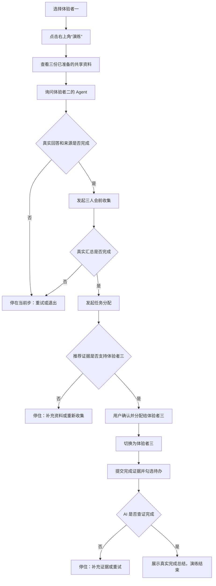

# Accord 体验账号教学演练设计

> 目标时间：2026-09-07 路演前教学与现场自由体验。本文定义体验者一、体验者二、体验者三专用的单次引导演练。建成、堡天、舒奥仍按人工操作手册完成正式路演，不显示“演练”入口。前后端、真实模型与跨账号任务闭环已于 2026-09-06 完成联调验收。

## 一句话方案

体验者一点击右上角“演练”，随后每步只点一次右上角的阶段主按钮。页面先用手指指出即将操作的位置，约 650 毫秒后填入固定练习内容或触发页面原有按钮，再等待真实接口返回；满足本步条件后才开放下一个阶段动作。

这是一套可退出、可恢复的产品教学，不是录屏、前端假数据或无人看管的自动播放。它帮助操作者学习真实操作路径，正式路演仍使用建成、堡天、舒奥三个账号人工上传、输入和点击。

## 两种使用方式必须分开

| 方式 | 账号 | 入口 | 数据准备 | 操作方式 | 用途 |
| --- | --- | --- | --- | --- | --- |
| 正式人工路演 | 建成、堡天、舒奥 | 正常产品入口 | 人物与本地材料；共享资料现场上传 | 按[操作手册](../路演案例/2026-09-06-001-三账号现场演示-操作手册.md)人工完成 | 向评委证明产品可真实使用 |
| 教学演练 | 体验者一、体验者二、体验者三 | 任一体验账号右上角“演练”，流程统一从体验者一开始 | 每个体验账号预置一份团队共享资料 | 操作者逐次点击阶段主按钮，系统指向并调用原有动作 | 路演前学习、评委快速理解 |

正式演示账号不显示“演练”，也不注入体验资料。体验账号的聊天、会议、任务和资料不能进入正式演示账号所在的协作范围。

## 用户看到的流程



## 引导交互

### 固定结构

- 右上角保持一个轻量步骤面板，例如“步骤 2 / 5”，旁边只有“退出”和一个阶段主按钮；主按钮会显示“发送问题”“开始收集”等当前动作。
- 当前目标使用聚光框定位，其他页面仍可见；不打开大段说明弹窗。
- 阶段主按钮使用“发送问题”“开始收集”“分配给体验者三”等当前动作名称；只有当前前置条件满足时才可用。模型执行中显示页面已有的真实阶段，按钮保持不可用。
- 每次点击阶段主按钮后，手指在目标控件旁出现约 600～700 毫秒，并播放一次按压动作；随后才自动填入固定输入或触发原有按钮。
- 操作者只需要点击右上角的阶段主按钮；状态机随后调用页面原有的 React action，业务按钮与正常手动操作共用同一套接口和校验。
- 全程没有倒计时弹窗，不因几秒未操作而自动跳步。
- 点击“退出”后保存当前步骤与已创建对象的 ID；再次点击“演练”时从仍然有效的步骤恢复。点击“结束演练”后清除本轮进度，用户之后可主动开始新一轮。

### 为什么不能只做一个自动播放脚本

聊天、会前收集、任务推荐和完成判断都包含真实异步结果。单纯按时间自动点击会在模型尚未返回时越过关键步骤，也会掩盖权限或证据问题。因此引导由两部分组成：Driver.js 只负责定位与聚光，自建状态机负责真实业务状态、等待条件、跨账号恢复和错误处理。

## 五步演练

### 1. 准备上下文

进入演练时调用 `POST /api/tutorial/prepare`。接口只补齐缺少的三份 Markdown 共享资料，不删除、不覆盖用户后来上传的内容，重复调用结果一致。

三份资料及其内容边界为：

- `体验者一-Accord路演统筹与工程进展.md`：负责串联演练、发起会前收集与任务分配。
- `体验者二-产品定位与路演决策.md`：负责产品与路演口径，已确认“Agent 先代答、展示来源、必要时找本人”的演示顺序。
- `体验者三-工作台UI与1440宽度复核.md`：负责工作台 UI / UX 与 1440 宽度复核，有相应职责和近期成果，但尚未完成本次新任务。

引导打开右侧工作池并指向资料列表。只有确认三份资料存在且范围正确，才开放“询问同事 Agent”。此步不预建聊天、Agent 答案、会议、任务、完成成果或总结。

### 2. 询问同事 Agent

状态机进入“找同事 → 体验者二”，把以下练习问题填入正常聊天输入框：

```text
明天的 Accord 路演应该聚焦哪三个动作？请只依据你已共享的资料回答，并列出来源。
```

手指指向“发送”，随后触发原有发送动作。页面等待体验者二 Agent 的真实回复完成，并检查响应中存在真实来源；回复正文、来源名称、模型耗时和用量都不能预制。满足条件后才进入会前收集。

### 3. 会前收集

状态机进入“开会”，打开会议表单，选择三位体验账号，并填入：

```text
明天路演前做一次三人同步：请分别汇总三个人已经完成的准备、仍需确认的事项和信息缺口，帮助我判断下一步。
```

手指指向“让 Agent 收集”，随后触发原有会议创建动作。引导等待真实流程完成，再指向会前简报和各成员来源。同步会只整理已知进展、差异与未知项，不伪装成真人会议，也不写死参会推荐。

### 4. 推荐并分配任务

状态机进入“分配任务”，填入：

```text
完成 Accord 工作台 1440 宽度最终复核

检查聊天正文、待办、工作池和资料来源展开是否存在拥挤、遮挡或视觉层级不清，并输出一份 Markdown 结论。请根据成员已经共享的职责和近期成果推荐 1～3 位负责人，最终由我选择。
```

手指先指向“让 Agent 收集”。真实候选返回后，只有推荐证据支持体验者三时，才指向体验者三和“分配给选中成员”。最后选择仍由用户点击“分配给体验者三”触发，不能由模型静默派活。

如果模型没有推荐体验者三，或者来源不足，引导停在候选页并显示“现有证据不足，补充资料后重试”。它不能直接选中体验者三、改写模型返回或伪造一条任务。

### 5. 完成待办

任务真实创建后，用户点击“切换并准备结果”，系统切换到体验者三，并用演练状态中的任务 ID 定位右上角待办。完成证据只能在任务分配之后提交，避免模型把未来成果当成既有进展。

引导通过正常工作池接口提交一份固定 Markdown 完成记录，内容说明 1440 宽度检查范围、发现的问题、处理结果和剩余风险；记录中的操作说明统一使用“阶段主按钮”，不把所有动作写成“下一步”。随后手指指向任务复选框，再触发原有勾选动作。只有 AI 读取证据并返回真实完成判断后，任务才进入完成状态并展示总结。

若 AI 判断证据不足，当前步骤保持打开，允许补充证据或重新整理；前端不能直接把任务改成完成。

## 阶段主按钮的状态约束

| 当前步骤 | 开放阶段主按钮的条件 | 点击后调用的真实动作 |
| --- | --- | --- |
| 准备上下文 | 三份体验资料均存在且属于体验范围 | 打开体验者二 Agent 会话并填入问题 |
| 同事 Agent | 本轮真实回答结束且至少有一个实际来源 | 创建三人会前收集 |
| 会前收集 | 三位成员收集与会议简报真实完成 | 创建任务推荐流程 |
| 任务推荐 | 候选证据支持体验者三，且用户确认选择 | 调用正常任务分配接口 |
| 完成待办 | 体验者三收到任务且完成证据已发布 | 调用正常待办勾选与 AI 整理 |

任何接口失败都会使阶段主按钮保持不可用，并在当前步骤提供“重试”。引导不得用固定延迟代替服务端完成状态；650 毫秒只用于手指提示，不表示业务已经成功。

## 数据与权限边界

- 准备接口只允许 `fixed_trial_1`、`fixed_trial_2`、`fixed_trial_3` 调用；演示账号和旧账号调用必须拒绝。
- 预置数据严格限定为三份团队共享 Markdown 资料，每个体验账号一份。接口按稳定标识只创建缺失项，不能覆盖同名用户内容。
- 教学聊天固定传入体验者二资料的 `source_id`；会前收集与任务推荐固定传入三份体验资料的 `source_ids`。创建协作流程时，后端会校验资料仍然存在、属于本轮成员、对全体成员可见，并保证每位成员至少提供一份本人资料。
- 一旦指定 `source_ids`，个人 Agent 只检索本轮指定资料，不读取此前演练产生的旧会话、静态记忆、历史任务或会议状态。因此反复演练不会让旧结果混入本轮证据。
- 普通非教学流程不传 `source_ids` 时，继续使用完整的四类上下文：个人工作区会话、共享资料、待办与会议状态、静态记忆；教学范围收紧不改变正式产品的默认行为。
- 三份资料进入体验范围的全文索引，但不能被建成、堡天、舒奥或旧账号搜索、引用和下载。
- 引导状态只保存步骤、对象 ID 和完成标记，不保存模型伪答案，也不在前端生成任务或完成状态。
- 身份切换继续走固定身份选择接口并签发新的 Bearer Token；所有后续业务动作的操作者都取自当前 Token。当前六个固定身份用于现场演示，允许用户在身份页显式切换，不等同于企业级登录鉴权。
- 体验者三的完成证据只能在任务分配成功后创建。暂停后继续演练时复用已保存的真实对象 ID，避免因刷新或切换账号重复建会、重复派活或重复勾选；主动结束并重新演练会创建新一轮业务对象。

## 开源组件选择

| 组件 | 适合点 | 本次判断 |
| --- | --- | --- |
| [Driver.js](https://driverjs.com/docs/configuration) | 体积小、无框架依赖；可以接管阶段推进回调并由业务代码决定何时移动 | 采用，只负责聚光、定位和步骤外壳 |
| [React Joyride](https://react-joyride.com/docs/how-it-works) | React 集成完整，支持受控步骤和异步生命周期 | 能用，但会把更多引导状态放进组件自身；本次跨账号业务状态仍需另写控制层 |
| [Shepherd](https://github.com/shipshapecode/shepherd) | 自定义按钮、目标推进和异步显示能力成熟 | 能用，当前需求不需要更重的导览配置 |
| [Reactour](https://docs.reactour.dev/) | React 页面快速搭建导览方便 | 更适合线性页面介绍，本次流程含真实后端等待和身份切换 |

Driver.js 不负责业务自动化。Accord 自建演练状态机，将每个步骤绑定到页面已有的导航、表单、发送、会议、分配和待办动作；这样移除教学层后，正式产品能力仍可独立工作。

## 失败与恢复

| 现象 | 页面处理 | 用户动作 |
| --- | --- | --- |
| 体验资料准备失败 | 停在第 1 步，保留已经成功的资料 | 点击“重试”；接口幂等补齐缺失项 |
| Agent 超时或没有来源 | 保留聊天与真实阶段，不开放后续阶段动作 | 重试本轮回答；仍无来源则退出检查资料 |
| 指定资料被撤权、删除或移出本轮可读范围 | 返回 `sources_changed`，清空不可继续使用的证据并停在当前步 | 恢复共享范围后重新收集，不能沿用旧证据推进 |
| 会前收集部分成员失败 | 展示已完成与失败成员，不生成假简报 | 重试失败成员或重新发起 |
| 没有推荐体验者三 | 展示实际候选和证据不足提示 | 补充体验者三共享资料后重新收集 |
| 身份切换后找不到任务 | 根据已保存任务 ID 重新拉取，不另造同名任务 | 返回体验者一检查任务是否真实分配 |
| AI 不认可完成 | 保留待办和整理会话 | 补充完成证据后再次勾选或重新整理 |
| 用户中途退出或刷新 | 保存当前步骤和真实对象 ID | 再点“演练”继续；也可主动重新演练 |

恢复策略始终优先复用真实对象。无法确认上一步是否成功时先查询服务端，不能用再次点击制造重复数据。

## 明天怎么用

教学或彩排时：

1. 在身份页选择“体验者一”。
2. 点击右上角“演练”。
3. 阅读当前一句提示，逐次点击右上角的阶段主按钮。
4. 每一步都等页面展示真实结果再继续；出现证据不足时按当前页提示重试或补充。
5. 最后切到体验者三，查看完成总结后结束演练。

正式展示时：

1. 分别选择建成、堡天、舒奥并打开三个窗口。
2. 不进入教学演练，严格按[三账号现场演示操作手册](../路演案例/2026-09-06-001-三账号现场演示-操作手册.md)人工上传、输入与点击。
3. 需要给评委快速体验时，再另开体验者一，让其使用“演练”或自由操作。

## 验收标准

### 入口与视觉

- [x] 只有体验者一、体验者二、体验者三能看到“演练”；建成、堡天、舒奥不显示该入口。
- [x] 右上角持续展示当前步数、退出和阶段主按钮，不出现倒计时弹窗。
- [x] 每次自动填入或原动作触发前，目标旁出现约 600～700 毫秒的手指提示。
- [x] 用户退出、刷新或切换到体验者三后可以恢复到正确步骤；完成后不自动重复弹出。

### 数据与权限

- [x] 准备接口重复调用不会产生重复资料，且只补齐三份体验共享资料。
- [x] 演示账号调用准备接口被拒绝，搜索和 Agent 来源也不能看到体验资料。
- [x] 准备动作不会创建聊天回答、会议、任务、完成证据或总结。
- [x] 教学聊天、会前收集和任务推荐都使用固定 `source_ids`；重复演练不会把旧会话、记忆、任务或会议状态混入本轮证据。
- [x] 指定资料被撤权或改变范围时返回 `sources_changed` 并停止推进；普通流程未指定 `source_ids` 时仍保留四类上下文。
- [x] 所有业务动作的操作者由服务端从当前 Bearer Token 解析；固定身份切换只通过明确的身份选择动作完成。

### 真实业务闭环

- [x] 同事 Agent 的回答、来源、阶段与用量来自真实模型调用。
- [x] 会前收集读取三位体验者的真实共享资料，并保存真实会议流程状态。
- [x] 任务推荐展示实际候选和证据；没有体验者三时停止，不强行推进。
- [x] 分配后体验者三收到真实待办，完成证据在分配后才写入工作池。
- [x] 勾选待办调用真实 AI 查证；证据不足时保持未完成，有证据时展示实际总结。
- [x] 退出引导后，用户仍能用相同页面和接口手动完成全部动作。

## 2026-09-06 实测记录

- 体验者一进入演练后只生成三份共享资料；重复准备不增加资料，也不预建后续结果。
- 教学聊天只读取体验者二的指定资料；会前收集与任务推荐只读取三份指定资料。重复演练已有的旧会话、记忆、任务和会议状态未进入本轮证据。
- 同事 Agent 真实返回回答与资料来源；三位个人 Agent 的会前收集从 `1 / 3` 推进至 `3 / 3` 并正常闭环。
- 任务推荐基于共享资料命中体验者三，确认后在其账号产生真实待办；完成记录在分配之后写入工作池。
- 体验者三勾选待办后触发真实 AI 核验，待办从进行中进入今日完成，并生成带多条可展开依据的完成总结。
- API 全量 97 项测试通过；本次涉及的生产 Python 文件通过 Ruff 检查与格式检查；Web 类型检查、生产构建和 UI 边界检查通过。

验收结论：教学层只负责编排和指引，聊天、会前同步、任务推荐、分配、完成证据与总结全部经过产品原有接口。正式演示账号与体验演练数据保持隔离。
