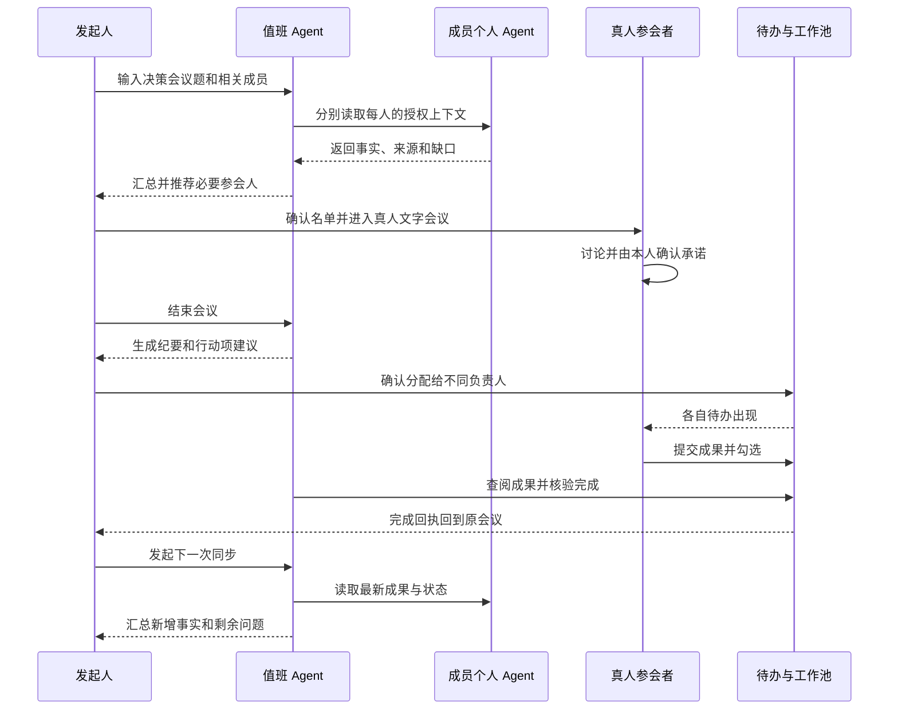

# Accord 会议任务闭环与交互反馈验收记录

> 本地来源：`docs/产品规划/2026-09-06-017-会议任务闭环与交互反馈-验收记录.md`。同步日期：2026-09-06。

> 依据：2026-09-06《JC 与庞堡天的会话》飞书文档（修订版 17）：https://my.feishu.cn/wiki/VHVVwESMOiT7qUkXu3hcb3mfnJf
>
> 结论：反馈中的七项主流程已经实现并完成自动测试；“会前收集 → 真人会议 → 发布给不同成员 → 分别完成 → 回执回流 → 下一次同步”已在本地正式服务中用真实模型完整跑通。

## 现在的完整流程

## 七项反馈的处理结果

| 飞书反馈 | 当前结果 | 验收证据 |
| --- | --- | --- |
| 同步会应推荐相关人并跳转聊天 | 已完成 | 同步会可返回最多 3 位需继续核实的成员；结果页显示“接下来找谁”和“去聊” |
| 新会议带入上一次会议正文 | 已修复 | 创建成功后立即清空本地会议草稿并关闭编辑器；新建会议从空状态开始 |
| 决策会“开始会议”应进入真人群聊 | 已完成 | 选人后创建关联群聊；会议输入框无 `@Agent`，三位成员可分别以本人身份发言 |
| 聊天框支持粘贴/上传图片和文档 | 已完成 | 普通聊天、群聊和会议均支持文字、图片、PDF、Word、PPT、Excel；一次最多 5 个，单个二进制文件 1 MB |
| 工作池与待办支持右键快捷操作 | 已完成 | 工作池：打开、下载、引用；待办：打开、引用、完成 |
| 找本人时自动概括前文 | 已完成 | 系统自动组合最近请求、最后一次完整 Agent 回答及可选补充，作为“转交摘要”展示 |
| 转交后双方都是真人，并可结束/超时结束 | 已完成 | 目标本人回复后进入真人状态，双方消息不再触发 Agent；双方可结束；30 分钟无消息由后台自动结束并启动摘要与待办建议 |

## 会议后任务闭环

### 行动项发布

会议结束后，Agent 只提炼“明确说过的下一步”。每条行动项初始为“待确认”。会议发起人可以：

- 确认分配：任务进入行动项所标注负责人的待办；
- 忽略：该建议不生成待办。

跨成员分配已修正为实际 `assignee_id`，不会错误写到发起人自己名下。

### 完成核验与回执

负责人勾选待办后，个人 Agent 调用上下文工具查阅工作池、会话和记忆。只有找到与该待办直接相关的已完成成果，才会：

1. 将待办标记为已完成；
2. 保存一条完成摘要和记忆；
3. 将摘要作为“完成回执”展示回原会议行动项。

证据不足时，待办保持未完成并只追问缺失结果。

### 下一次会议

原会议的已接受任务全部完成后，发起人看到两个选择：

- 本轮结束；
- 发起下一次同步。

下一次同步与原会议建立关联，携带上一轮纪要，并重新收集成员最新资料。创建接口具备幂等保护，重复点击不会创建多场相同跟进会议。

## 附件与权限边界

- 附件默认属于当前对话，不会自动进入团队工作池。
- 当前对话的授权参与者可看到附件元数据并打开或下载。
- 只有附件所有者可将自己的文字附件发布到工作池；接收方不能替发送方公开文件。
- 文字附件可以进入 Agent 上下文；图片、PDF 和 Office 文件当前仅供人查看和下载，不会被模型假装解析。
- 单个文字附件上限 256 KB，文字内容合计 64,000 字符；单个二进制附件上限 1 MB，总请求约 3 MB。

## UI 行为

- 会议主流程只保留一个核心按钮：收集、开始会议、结束会议、确认分配或发起下一次同步。
- 状态展示真实数量，如“已收到 2 / 3 位 Agent 的回复”，不使用虚假进度条。
- 待办继续放在右侧上下文面板，不新增独立大模块。
- 完成回执直接显示在原行动项下方；无需额外弹窗。
- 找本人保持同一对话，Agent 必须先完整回答，不增加倒计时弹窗。

## 验收结果

### 自动检查

- API：`PYTHONPATH=apps/api .venv/bin/python -m unittest discover -s apps/api/tests -q`，98 项通过。
- Web：`npm run build --workspace @accord/web` 通过。
- UI：`npm run check:ui` 通过。
- 代码差异：`git diff --check` 通过。

### 浏览器手工链路

本次使用体验者一、二、三完成：

1. 真实同事 Agent 回答与来源；
2. 三位 Agent 的决策会前收集；
3. 三位真人的群内确认；
4. 两项行动分别发布到体验者二、体验者三；
5. 两位负责人分别勾选并通过 Agent 核验；
6. 原会议展示两条完成回执；
7. 发起并完成下一次同步。

中途服务重载导致下一次同步进入错误态，教学层正确停止；修正恢复逻辑后通过同一按钮重试并完成。演练没有用前端固定结果越过错误。

## 当前限制

- 会议是站内文字会议，不替代飞书会议或腾讯会议的音视频能力。
- 图片、PDF 和 Office 附件尚未接 OCR/文档解析，因此暂不作为 Agent 证据。
- 30 分钟自动结束由后台轮询执行，当前没有可配置的团队级超时策略。
- 跟进会议由发起人确认后创建，系统不会在无人确认时自动拉起真人会议。

