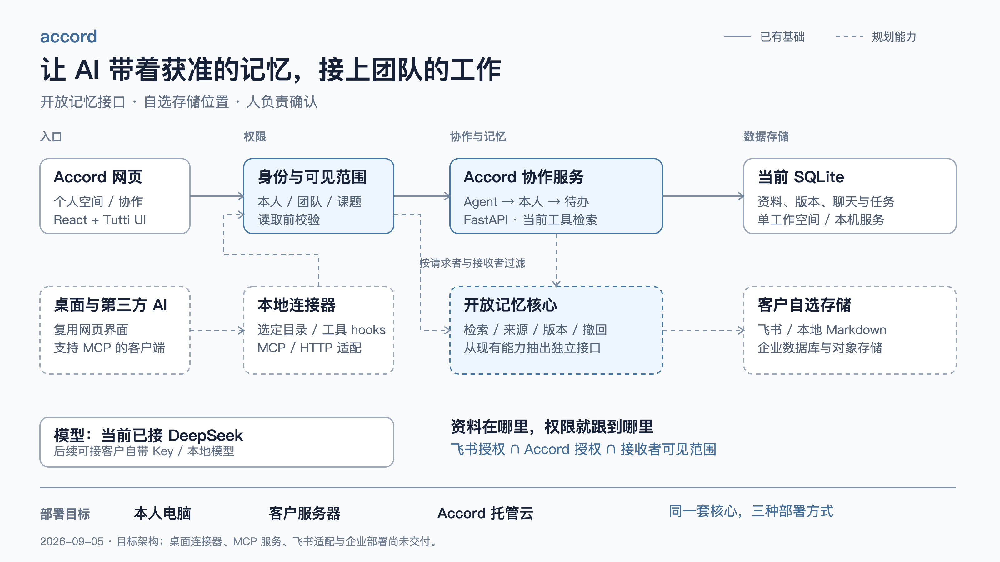

# 开放记忆与协作平台：路演怎么讲？

Accord 让每个人的 Agent 带着获准的工作资料先回答，再在同一个对话里接上本人，形成可确认的待办。下一步把记忆能力抽成开放核心，让客户自行选择 AI 工具、数据存储和部署位置。

> 面向 JC、队友与黑客松评委；核对时间：2026-09-05。当前产品为单工作空间的本机 Web 服务。下面明确区分现有实现与目标架构；商业模式为建议，尚无成本实测或收费验证。

## 30 秒怎么讲？

“团队的信息散在文件、聊天和每个人的 AI 里。Accord 让同事先问你的 Agent，有必要时在同一个对话里找你本人，最后由负责人确认待办。我们计划把记忆核心开源，资料可以放在自己的电脑、公司服务器或飞书。我们提供的是团队协作、权限控制和持续同步服务，让已有的资料和 AI 真正接上团队的工作。”

## 本地 App、云端和飞书如何连起来？

请求先经过身份与可见范围校验，再进入协作服务或记忆检索；存储位置和使用的模型分别可替换。

[高清 PNG](图片/06-开放记忆与协作架构.png) · [可缩放 SVG](图片/06-开放记忆与协作架构.svg) · [投屏 PDF](图片/06-开放记忆与协作架构.pdf)

实线是已有基础；虚线是规划。当前资料、版本、聊天和任务都由 Accord 的 SQLite 管理；独立记忆核心、外部 MCP 服务、飞书适配、企业部署尚未交付。现有内部工具不是对外 MCP 服务。

## 用户现在会看到什么？

| 位置 | 本轮已经改动 |
| --- | --- |
| 左侧入口 | “个人空间”处理自己的工作，“协作”找同事 |
| 输入区 | 不选资料时显示“自动查找”；选定资料或文件夹后缩小范围 |
| 右侧资料栏 | 可筛选、展开文件夹、打开资料、拖入输入区或点击加号指定 |
| 个人聊天 | 删除后进入回收站；可撤销、恢复，无确认弹窗 |

协作仍沿用同一对话中的 Agent → 本人 → 本人确认待办。私人内容不会因为换成“协作”入口而自动对同事公开。资料树显示的是当前账号获准读取的 Accord 资料，不是本地磁盘目录；同事资料按所有者分组，不代表文件夹共享权限已经实现。

当前状态识别只覆盖本人开启共享后的 Accord 活动，不能据此判断正在使用别的软件或开会。已支持多人群聊与显式 @ Agent；Agent 自动轮流协商、日历/会议接入和文件夹权限继承仍需实现。

群聊从协作列表旁的加号进入，选择同事后即可聊天；需要信息时 @ 指定成员的 Agent。新群不带入私聊，新成员只看加入后的消息；Agent 只能读取所有群成员都获准查看的资料。具体界面和验收见 [用户体验与前端交互](../产品规划/2026-09-05-012-用户体验与前端交互-设计文档.md)。

## 本地 App 到底要做什么？

**建议复用现在的 React 界面，增加 Electron 桌面宿主和本地连接器；无需重写整个产品。** 这是下一阶段的实现建议，尚未安装或打包。

1. 用户首次选择目录或 AI 工具，并设置“仅自己 / 指定团队”。之后在这个范围内自动同步。
2. 连接器监听文件变化，或接收已支持工具的 hooks 事件；解析出来源、版本和内容，写入本地索引。它不扫描全盘，也不把配置 MCP 当作采集已完成。
3. 用户问问题时，AI 调用检索工具，只读取需要的片段。断网则显示上次同步时间；联网后通过幂等队列补传。共享规则改变时停止后续读取并清除相应索引、缓存，不能承诺收回别人已经看到的文本。

文件读取、凭据保管和目录监听放在本地进程，通过少量明确的 IPC 方法提供给界面；保持上下文隔离，不把完整文件系统能力暴露给网页。参考 [Electron 上下文隔离](https://www.electronjs.org/docs/latest/tutorial/context-isolation) 与 [进程通信](https://www.electronjs.org/docs/latest/tutorial/ipc)。

可以先做轻量连接器配网页，再打包桌面端；这样能先验证资料同步。打包、签名、自动更新和安装体验是单独的交付工作。

## “所有 AI 都能接”需要什么条件？

开放的是记忆接口和数据格式，接入方需要支持 MCP 或增加 HTTP 适配器。不能直接承诺所有现有 AI 应用开箱即用，也不能自动获取它们的私人历史。

建议先开放读取工具 `list / search / read`，写入独立走 `propose / confirm`：AI 提炼的是候选记忆，只有明确的保存或既定规则才能成为团队知识。数据至少带上内容、所有者、来源、版本、可见范围、更新时间、同步状态和撤回标记；一次回答记录实际引用的版本。

本地工具可用 stdio，远程服务可用 Streamable HTTP；协议之外还要做账号授权、租户隔离和逐次权限校验。参考 [MCP 2025-11-25 传输规范](https://modelcontextprotocol.io/specification/2025-11-25/basic/transports)。

上游 [ai-memory](https://github.com/akitaonrails/ai-memory) 可以作为本地引擎候选；当前是静态评估，未集成。其 [MIT LICENSE](https://github.com/akitaonrails/ai-memory/blob/master/LICENSE) 不替代我们自己的发布与依赖审查。Accord 尚未选定开源许可证或对外发布独立记忆仓库。

## 飞书能否承担存储？

**能作为资料来源或正文存储候选，但不能代替整个 Accord 后端。** 聊天状态、授权记录、检索索引、同步队列与审计仍需要数据库；这些数据也应留在客户选择的部署环境。

建议先接一个飞书文件夹，只读导入；后做增量更新、删除与撤权传播，最后才做双向写回。每次使用必须满足“源平台允许读取 ∩ Accord 允许使用 ∩ 接收者允许看”，不能把应用 Token 的权限当作每个成员的权限。

飞书提供 [当前用户权限检查接口](https://open.feishu.cn/document/server-docs/docs/permission/permission-member/auth)。具体应用授权范围、资源类型支持、额度、限流和撤权延迟还需接入实测；不能承诺免费无限存储或实时撤权。查不到最新权限时暂停读取相关内容。

## 部署位置如何选择？

| 方式 | 谁保管数据、负责运维 | 适合的起点 |
| --- | --- | --- |
| 本地 | 本人设备保存记忆与索引 | 个人使用；团队共享需同步服务或可达服务器 |
| 公司内网 | 公司服务器保存数据库、索引和文件 | 企业自行部署，Accord 提供安装与维护支持 |
| Accord 托管 | Accord 运维服务；可连接客户自带资料源 | 小团队快速使用 |

三种方式复用一套核心和存储适配接口，不做三份分叉产品。本地存储不等于 AI 离线：调用云模型仍会发送所需片段；要求数据完全不离开内网时，还需要内网模型、网络策略与相应验收。

## 商业化应该收什么钱？

**开源降低接入门槛，团队服务承担持续收入。仅代付第三方费用，无法覆盖同步维护和客户支持。**

| 产品层 | 建议收费对象 | 提供的价值 |
| --- | --- | --- |
| 开源核心 | 自行部署；可另购支持 | 记忆格式、MCP/HTTP 适配、基础检索和存储接口 |
| 托管团队版 | 工作空间基础费＋活跃席位 | 持续同步、成员管理、备份、协作与托管维护 |
| 企业部署 | 部署/集成费＋年度维护 | 单点登录、审计、内网升级、专属连接器和支持 |

客户自带模型 Key、飞书或存储账号时，第三方账单由客户直接承担，我们收服务费。使用我们代管的模型或存储时，另列用量、预算上限和费用；超额前停止或取得追加预算，不混成“无限使用”。以上为定价结构建议，未确定金额。

月成本＝模型调用＋服务器/数据库＋存储与流量＋索引/同步任务＋维护支持。低成本可以作为目标，不能在缺少活跃人数、资料规模与调用量时承诺金额。先测小团队一周的每次问答成本、同步失败率、有效解答率，以及减少了多少次找本人；模型价格按供应商 [当期价目表](https://api-docs.deepseek.com/quick_start/pricing/) 核算。

## 路演之后先做哪三步？

1. 抽出开放记忆核心：先提供只读 MCP/HTTP 入口。验收两个不同客户端可读同一份获准资料，私有资料不可跨账号读取。
2. 做一个真实连接器：优先飞书单文件夹只读接入，验证新增、改版、删除、撤权和限流；再做本地目录监听与断网补传。
3. 打包桌面端并验证部署：先跑通安装、授权目录、更新与卸载；企业化前再补 SSO、租户隔离、备份恢复和成本计量。

截至群聊迭代的验证：50 项后端测试、类型检查、生产构建、UI 规范检查通过。此前已验证资料选择/拖动、草稿保留、删除/恢复；本次新增建群、多方消息、邀请、改名、历史隔离和三种屏宽检查，并用真实 DeepSeek V4 Pro 验证群内共享资料检索与引用。构建仍有约 529 KB 主包提示。
