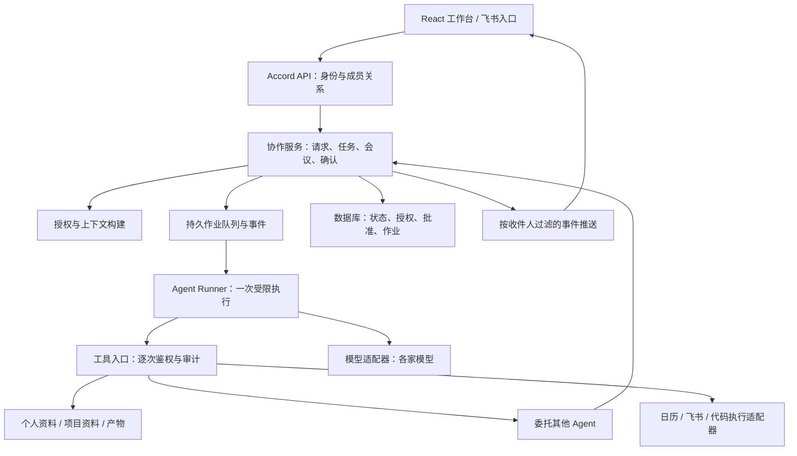
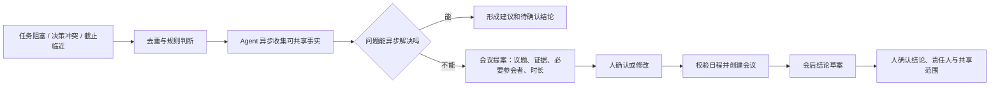

# 多人多智能体协作架构

> 2026-09-05，北京时间。状态：设计建议，尚未实现或完成多人验证。依据 JC 的产品需求、堡天 MVP 隔离运行结果、Tutti 固定 commit 的部分源码及官方参考资料。比赛截止：2026-09-06 12:00（UTC+8）。参考项目的证据等级见[参考实现调研](../竞品调研/2026-09-05-003-多智能体协作参考实现-调研记录.md)。

## 结论与范围

Accord 应有自己的协作服务，负责“谁委托谁、带什么资料、能执行什么、结果给谁、谁来确认”，底层模型和 Agent 运行时可替换。每个人有一个对外代表他的入口，内部可以配置多个专业 Agent。项目协调 Agent 负责串联请求，不天然拥有所有成员的私人资料。

产品上保留“每人一个专属 Agent”的简单入口；数据模型允许一个人拥有多个 Agent。先做可靠的代答、找本人和确认链路，再扩展代码执行、跨设备工作区和主动会议。

本设计承接正在推进的 [Tutti 工作台接入计划](../产品规划/2026-09-05-004-Tutti工作台接入-实施计划.md)：前端 React / TypeScript，后端先保持 FastAPI / SQLite。此处没有修改该任务的代码，也没有将下述完整架构计入本次比赛已交付功能。

## 六类对象先分清

| 对象 | 负责什么 | 必须区分的概念 |
| --- | --- | --- |
| 人 / 成员 Membership | 身份、项目角色、谁可以批准什么 | 项目管理员不因管理角色自动获得私人会话读取权；数据库运维权另属基础设施边界 |
| AgentDefinition | 所有人、职责、工具白名单、模型配置引用、版本 | 一个 Agent 不等于一个模型账号；同一模型可服务多个 Agent |
| Session / Run | 某次对话及某次实际执行，记录配置版本和状态 | 不能将所有来访者塞进所有人的同一个私人会话；进程可结束，会话记录仍在 |
| Workspace / Resource | 资料归属、版本、可见范围、草稿和成品 | 资料工作区不等于执行容器，也不等于团队聊天房间 |
| Grant | 谁能对哪个对象做哪个动作、期限和使用上限 | 能调用 Agent，不自动等于能看其记忆、读文件或修改文件 |
| Task / Proposal | 委托、依赖、验收、等待真人的动作 | 模型回答“完成了”不等于业务任务已经完成 |

建议另保留 Artifact（产物版本）、Approval（批准记录）、Event / Job（事件与后台作业）、Audit（访问与动作记录）。先在一个应用中实现这些职责，无需拆成很多微服务。

## 总体架构

读图：界面提交意图；Accord 校验身份并创建任务；后台执行器只拿到本次任务获准的资料和工具；模型提出动作，工具入口校验后执行；业务状态落库再通知界面。授权是调用路径的一部分，不能只写在 prompt 或前端按钮上。

比赛阶段：一个 FastAPI 服务、一个可恢复的后台 worker、SQLite 和受控附件目录足够承载小团队演示。SQLite job 表记录领取租约和重试；关键状态与待发送事件在同一事务提交。后续多实例部署再迁移 PostgreSQL，文件增多再接对象存储；不以引入 Redis、Kubernetes 或向量数据库为开工前提。

## 每个人如何拥有多个 Agent

例：JC 拥有协调、产品、调研三个 Agent；堡天拥有协调、开发、评审三个 Agent。成员列表只展示每个人的协作入口，可展开查看他愿意提供给团队的能力。

对外的“堡天 Agent”先判断是否能从已授权资料回答；需要代码能力时，在堡天的授权范围内委托开发 Agent。各专业 Agent 的记忆命名空间、工具和会话独立，允许显式共享某个项目的已批准记忆。换模型只修改配置引用，不改成员身份和任务归属。

每次 Run 保存 agent_revision、模型配置版本、输入资源版本、授权引用和调用链 ID，便于解释当时为何这样回答。版本快照用来复现配置；实际执行仍要检查授权是否已撤回。密钥保存在执行侧配置或密钥服务中，不放进快照、消息、前端或委托 payload。

多 Agent 不意味着为每个角色一直开一个昂贵进程。普通代答按任务唤起；只有长任务、代码环境或本地设备工具需要持续运行的 worker。模型不应自行无限创建 Agent，允许创建的类型、并发和预算由服务端限制。

## 别人的 Agent 怎么访问我的工作区

先提供三种明确能力，默认从前两种开始：

| 能力 | 用户感知 | 实际实现 |
| --- | --- | --- |
| 问资料 | “问堡天 Agent 接口约定” | 在对外答复专用会话中检索已授权资料，返回答案和来源；不继承堡天的私人聊天历史 |
| 委托工作 | “请堡天的开发 Agent 评审这份设计” | 创建有输入、期限、接收者和输出要求的子任务，在对方执行侧运行，返回任务状态及产物 |
| 共享资源 | “让 JC 的调研 Agent 读取这三份文档” | 对具体资源或集合授予 read；修改用独立的 propose_write 权限，合并另行批准 |

资料至少分为个人私有、已授权代答资料、项目共享成品、任务临时交换区。临时交换区只放本次委托的输入快照和输出，不挂载整个个人目录。

Grant 的建议字段：team_id、grantor_user_id、grantee_user_or_agent_id、resource_selector、actions、purpose、allowed_recipients、expires_at、revision、revoked_at，以及可选的调用/并发上限。资源列表与搜索结果、下载、历史版本、WebSocket 推送都执行相同的可见范围规则。

一次代答的有效读取范围，是 Agent 的基础权限、本次委托授权、资料 ACL 和答复接收者可见范围的交集。授权判断使用认证会话中的用户身份和服务端记录的代理关系，不能信任浏览器传入的 owner_id 或模型生成的授权声明。

关键点：不能先把私人资料全部喂给模型，再要求它“不要泄露”。需要对外回答时创建干净的执行上下文，只装入允许向该接收者使用的资料；私人会话的摘要、向量、缓存和旧推理上下文同样不能沿用。只有所有人明确批准的脱敏摘要才能跨范围发布，不能靠另一个模型的过滤判断自动解密权限。

共享资料产生的衍生摘要继承来源的访问约束；缓存按调用身份、资源版本、接收者和授权版本区分。撤回后阻止新读取、后续工具调用与发布，并失效缓存、取消可取消的任务。已合法交付到他人手里的内容无法靠“撤回”远程抹除，界面需要准确表达这个边界。

## 跨 Agent 委托的一条完整流程

以 JC 请求堡天的 Agent 评审接口为例：

1. JC 在工作台选择堡天的公开能力，提交需求和明确可分享的附件。
2. API 从登录态确定 JC 身份，检查项目成员关系、调用授权、输出收件人、期限与并发余额。
3. 事务创建 Task 和 Job，分配 task_id、parent_task_id、idempotency_key，返回受理状态。
4. worker 领取租约，在堡天的执行域启动一次新的代答/评审 Run，只装入获准的输入与资料。
5. 需要更多资料时返回 need_input 或 need_owner；能完成则提交带来源的结果。需要执行额外动作时生成 Proposal，由策略判断是否需人批准。
6. 输出写入隔离的产物区，发布前再次检查授权和目标收件人，合格才投递 JC。未确认的产物不自动进入项目共享池。
7. 任务责任、会后待办或结论入记忆按产品规则由人确认，记录确认者、版本及时间。

建议内部任务状态为 queued → running → waiting_input / waiting_approval → submitted → accepted，另有 failed、cancelled、expired。这里 accepted 表示已按验收规则接受结果；不得因任意聊天回复或 Agent 自报成功而迁移到此状态。

内部协议先用受控 HTTP 调用加持久任务；以后接第三方 Agent 时可加 A2A 适配。A2A 适合表达 Agent 间任务、状态与产物，MCP 适合连接工具和资源；两者可以同时存在，Accord 的身份、授权和确认规则仍需自己实现。[A2A 与 MCP 官方说明](https://a2a-protocol.org/latest/topics/a2a-and-mcp/)

限制循环委托：保留完整父任务链；设最大深度、单任务子任务数、总调用预算和截止时间；同一委托键只受理一次；取消沿子任务传播。预算在启动前预留，失败释放；模型服务结束后上报的 token 数不能当作绝不会超支的实时硬额度。

## 每个人的 Agent 跑在哪里

| 形态 | 适合阶段 | 工作方式与边界 |
| --- | --- | --- |
| 集中托管 | 比赛与早期团队 | 一套 Accord 服务承载多个受控 Agent 上下文；不执行任意 shell。身份/数据库访问隔离必须在后端成立 |
| 独立云端执行环境 | 后续代码与工具任务 | 每人或每个信任域单独容器/虚拟机；按任务再划分工作目录。容器还需限制挂载、网络、资源和凭据，不能把宿主机 Docker socket 交给普通 Agent |
| 每人本地 Runner | 必须访问个人电脑时 | 本地 Runner 主动连中央服务领取已授权任务；中央只下发任务与资源引用，设备回传获准产物。离线显示 queued / owner_offline，不能暗中改到云端读取另一套私有数据 |

第一版不要直接打通队友电脑的 shell。若必须跑代码，以独立 checkout / worktree 减少编辑冲突，并置于受限执行环境；Git worktree 只解决文件并行问题，不是安全沙箱。

中央协调层负责身份、任务、授权、租约和审计；各执行域保管自己的模型凭据与本地能力。跨机器不是共享 Key 或互开完整磁盘，而是转发经过授权的任务。

## 如何主动拉会

“主动”可以先做到发现阻塞、收集信息、形成议程并请求拍板。当前 v0 仍要求人决定是否找真人、参会对象及会议结论；因此第一版默认主动提议，不直接群发邀请。后续只有用户明确设置的规则才允许自动预约。

例：后端将接口字段改名，前端任务仍引用旧字段，且演示截止临近。系统先从任务依赖和已共享接口版本发现冲突；协调 Agent 向两边 Agent 各收集一次可公开的说明。若能补一份兼容方案，直接提交建议；若涉及产品取舍，才提议请 JC 和堡天开一个短会，附冲突证据、两个选项与待决问题。

技术上分四段实现：

- 触发：业务事件优先；定时检查负责发现没有新事件的超时/阻塞。轻量规则先筛选，只有候选事件才调用模型。
- 准备：读取有权限的任务和资料；返回证据 ID、阻塞类型和建议动作，拒绝没有依据的“大家可能需要开会”。向人的通知受既定产品授权约束，Agent 间交换也只用可共享内容。
- 提案：保存 MeetingProposal，包含 participants、agenda、evidence_refs、duration、time_candidates、timezone、proposal_revision。日历授权只需忙闲信息时不读取私人事件标题。
- 执行：批准绑定具体版本和参会对象。创建前复查权限与忙闲；改了参会人/议题等关键字段就使旧批准失效。创建日历、拉群、订会议室是不同外部动作，分别记录结果。超时先查询外部结果，不能盲重试制造两个会议。

建议状态：detected → collecting → proposed → approved / rejected / expired → scheduling → scheduled / failed → concluded_draft → confirmed。结束会议不等于结论已批准；只有 confirmed 的目标结论进入获准记忆，待办按责任人的确认规则单独生效。

降噪配置采用可调默认值，例如同一问题冷却 30 分钟、每项目每日最多 3 个会议提案、工作时间内通知。它们是待试验的参数，不是效果已经验证的标准。用户可拒绝、延后、静音或改为异步处理。Agent 不需要永久自言自语，也不应每分钟让所有 Agent 相互询问。

后续可授权“本项目工作时间内、最多 15 分钟、指定内部成员、每周至多两次”的自动预约规则；授权内容必须结构化并可撤回。没有回复不能等同于批准。所有存储时间带时区，统一保存 UTC，展示时转 Asia/Shanghai。

## 建议的数据与接口契约

| 表 / 实体 | 关键内容 |
| --- | --- |
| memberships / agents | team_id、user_id、角色；owner_id、能力列表、agent_revision、model_config_ref |
| workspaces / resources | owner_id、project_id、visibility、资源版本、来源与共享对象 |
| grants | 授权双方、动作、资源、接收者、期限、撤回版本 |
| sessions / runs | 参与身份、用途、上下文范围、配置快照、调用链、状态 |
| tasks / artifacts | 请求者、执行 Agent、责任人、依赖、版本化产物、验收状态 |
| proposals / approvals | 动作参数、版本、批准者、有效期、执行结果 |
| jobs / outbox / audit | 幂等键、领取租约、重试时点、事件投递与访问决策 |

建议命令接口：POST /requests、POST /tasks/{id}/delegate、POST /proposals/{id}/approve、POST /artifacts/{id}/publish、POST /meetings/{id}/confirm。它们表达明确意图，避免任意客户端提交一个 status 字段就修改结果。

读取接口：GET /me、GET /projects/{id}/snapshot、GET /tasks/{id}、GET /resources/{id}、GET /events。每个接口从登录态确定请求者，再按对象鉴权；snapshot 必须是该用户的投影，不能返回全库给前端过滤。事件推送、断线重放、引用链接和附件下载遵循同样规则，避免 REST 正确而 WebSocket 泄露。

关键修改携带 expected_version；重复点击携带幂等键。数据库事务保证本地状态与 outbox 同步；外部 API 通常无法得到跨系统“严格一次”的保证，需稳定请求键、回查与人工可见的未知状态。

## 对当前项目的落地顺序

以下问题来自已检查的堡天原始 MVP，不推断正在独立开发的新前端/后端仍有同样问题。具体复现见[验收记录](../产品规划/2026-09-05-003-现有原型评估与比赛收口-验收记录.md)。

| 顺序 | 必须落地的行为 | 依据 |
| --- | --- | --- |
| P0 | 可信演示登录态；API、资源和 WS 按成员过滤 | 旧 MVP 匿名全量 snapshot / WS 暴露私人资料；任意请求能写任务状态 |
| P0 | 对外代答专用上下文；共享资料与私人会话隔离 | 旧代答路径读取所有人私人历史，不能仅靠提示词阻止外传 |
| P0 | 找本人、状态变更、共享、结论入记忆走明确命令和批准记录 | 已复现无关回复误完成待办及旧 close 接口绕过会议确认 |
| P0 | 幂等提交、来源、失败状态、UTC 时间处理 | 旧通知在 UTC 与本地时间转换时偏移；模型未配置不能伪装成功 |
| P1 | 一个用户可配置多个 Agent；一次受限委托返回产物 | 验证对象模型，无需同时运行大量 Agent |
| P1 | 阻塞事件生成会议提案；人在待拍板区确认 | 先闭环提案和确认，真实日历接入可后续验收 |
| P2 | 本地 Runner、代码沙箱、外部 A2A、复杂工作流 | 需求和最小业务边界稳定后再扩展 |

比赛前建议聚焦 A 问 B 的 Agent → 授权资料代答 → 显式找本人 → B 确认 → 双方可追溯任务。多人多 Agent 通过数据与一条委托展示；主动会议若来不及接真实日历，清楚标注为“提案演示”。不把整套会议、视频通话和分布式桌面运行时同时塞进剩余时间。

若流程增多，LangGraph 的持久化与 interrupt 可承载等待人确认的工作流；恢复会从被中断节点开头重新执行，副作用仍需幂等。它不替代 Accord 的权限和业务验收规则。[LangGraph 官方说明](https://docs.langchain.com/oss/python/langgraph/interrupts)

## 验收必须覆盖的例子

- A 可以读取 B 共享的接口文档，但 REST、WS、下载、搜索和历史记录都不能得到 B 的私人笔记；代答上下文也没有它。
- A 调用 B 的开发 Agent 成功，不因此得到 B 的模型 Key 或执行私人 shell 的权限。
- 两个请求者调用同一个 Agent，彼此的任务输入和回复不串入另一会话；有意共享的会议记录另按成员范围呈现。
- 同一请求重试只产生一个任务；任务失败/超时可恢复，不把未知结果当成功。
- 无关聊天回复不改变任务完成状态；只有有权者的明确动作可以确认。
- 授权撤回后阻止后续读取与发布；配置快照不能恢复已经失效的授权。
- 同一阻塞事件只生成一个有效会议提案；无人批准不创建外部日历；批准旧版本失败并提示重新查看。
- 北京时间 18:00 的通知在存储、读取、显示和真正触发时一致；模型服务不可用时展示可理解的失败或明确标识的检索演示。

本轮完成的是设计与来源核对；上述条目不是已通过的测试结果。对 Accord 的差异化也仍是待验证假设：在尊重个人资料与决策权的前提下，让 Agent 先接住协作，再把最少且准备充分的事项交给人。
