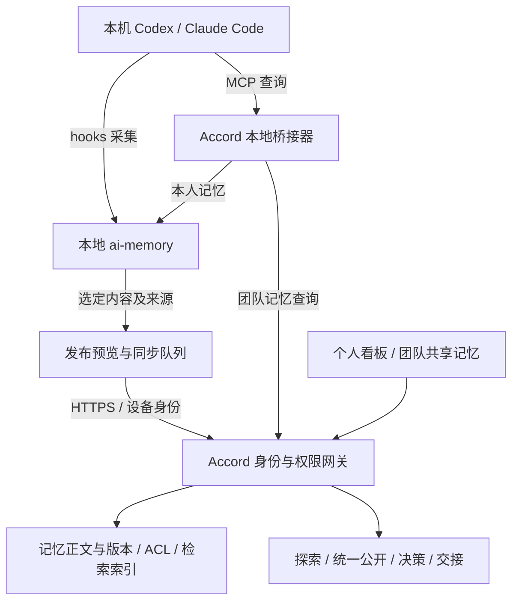

# AI Memory 接入与协作记忆平台

> 2026-09-05（北京时间）。来源：JC 本轮产品设想、ai-memory 官方文档与下载源码、Accord 当前代码。评估的 ai-memory commit：`a2fd58ccc5ff736274035e660846c831a0fd0e86`，Cargo workspace 版本 2.0.3。本轮仅下载和静态检查，未编译、启动、安装 hooks、读取私人会话或上传记忆。下述新增架构均为建议，未接入产品。

## 1. 产品判断

可以纳入。ai-memory 适合提供本地记忆采集、整理和跨工具检索；Accord 提供人的工作台、发布权限、团队共享视图、探索收束与交接。Tutti UI 继续承担界面基础，整体 Tutti 桌面宿主不成为必要依赖。

这会把产品定位向“让团队现有 AI 工具共享获准记忆并衔接工作”推进。成员可以继续使用 Codex、Claude Code 等熟悉的工具，Accord 内置聊天也保留，统一从同一权限入口读资料。

个人看板与全局记忆筛选可以成为主要界面，但仍需保留“记忆被用于哪次探索、决策和交接”的动作，否则产品容易只剩一个知识搜索站。此前独立探索、统一公开和人类拍板的工作流可以继续成为差异化。

## 2. 上游实际能力与缺口

| 能力 | 已核对的上游能力 | 不能直接推导的结论 |
| --- | --- | --- |
| 采集与读取 | 生命周期 hooks 采集事件；MCP 提供查询等工具 | 配置 MCP 不等于自动采集；采集也不等于完整恢复原生会话 |
| 多工具 | Claude Code、Codex 等列入支持矩阵；部分应用仅有 MCP | 不能宣称所有应用双向同步，必须逐客户端、版本验收 |
| 记忆存储 | Git 管理的 Markdown wiki，SQLite 检索索引，基础链路可不调用 LLM | 无需为了接入把 Accord 全部改写为 Rust，也不必先引入向量数据库 |
| 用户身份 | 用户身份、凭据、操作归属和部分本人交接隔离 | 不等于逐记忆或用户组 ACL；官方明确没有此能力 |
| 历史导入 | 可选 importer 支持 OMC Markdown 与通用对话 JSON | ChatGPT、Claude Desktop 等具体导出格式适配器仍需另做；不是万能历史同步器 |
| Web 查看 | 存在记忆浏览、JSON 读取入口 | 不等于我们的个人看板、发布审批、团队协作工作台已现成可用 |

具体限制：官方支持矩阵说明 Codex 没有可靠的自动真实会话结束事件，需要显式 finalize 才得到最终汇总 / 交接；Claude Code 的 assistant 最终回复采集另有双重 opt-in。原生 Windows 仍标为实验支持。以上是上游说明，本轮未复现。

最关键的权限证据在 [users.md](https://github.com/akitaonrails/ai-memory/blob/a2fd58ccc5ff736274035e660846c831a0fd0e86/docs/users.md)：作者记录与个人记忆槽的自动注入范围，不构成页面读取权限。对同一服务内的私有资料，不能只靠 workspace/project 名称、author_id 或前端过滤隐藏。

## 3. 推荐架构

每位成员安装一个 Accord 本地连接器，内部管理 ai-memory 进程及已选择的工具接入。个人原始事件和本地记忆留在本人设备；成员主动发布成果版本，或启用具体项目的共享规则后，才把对应内容同步到平台。个人云备份是独立选项：即使上传，也可以仍然仅本人可见。

图中本地桥接器、同步协议与平台扩展尚待实现。采集使用 hooks，查询使用 MCP，两条通路单独验证。桥接器聚合本人本地结果与平台授权结果，不把本人本地结果自动回传团队。

平台不需要实时连接每个人的电脑读取文件：已发布版本在平台可用，成员关机后仍能被队友检索；未发布内容显示为未同步，不假装实时在线。

## 4. 两种中心端方案与选择

### 推荐：本地 ai-memory，中心端由 Accord 管理授权记忆

本地复用上游引擎；中心端通过 Accord API 接收发布的版本，将正文、来源、可见范围与索引作为完整业务对象存储。先复用当前资源表和 SQLite，增加过滤后的全文检索。需要正式多租户部署时再迁移 PostgreSQL；这不是本次接入的前提。

这样可以直接沿用现有 `access.py`、`context.py`、`workspace.py`、`topics.py` 的约束，避免把私有探索和团队成果混入一个默认共享的 wiki。保持服务接口适配，不读取或双写上游运行中的 SQLite 文件。

### 可选：中心端继续用 ai-memory，但按相同可见人群隔离实例

一个上游实例 / 数据目录只能承载同一完整可见人群的知识。不同租户、个人私有库、不同课题私密范围需要独立隔离；Accord 网关先确定调用者能访问哪些实例，再查询并合并结果。上游服务与管理凭据不直接暴露给成员工具。

这适合少量固定团队空间的验证，成员变更和实例数量增长时运维会变复杂。不可只在同一上游库里标 `private=true`，然后在搜索结果返回后过滤：全文、摘要、引用、全局检索、原始事件回退及后台归纳都可能已跨越权限边界。

两种方案选一条作为某份数据的写入路径。首版推荐前者，不同时建设两套中心记忆系统。

## 5. 上传、共享和使用是三个独立动作

| 动作 | 用户含义 | 首版建议 |
| --- | --- | --- |
| 本地采集 | 允许从指定工具和项目记录内容 | 选择具体项目，支持暂停与排除；未选择的目录不接入 |
| 上传 / 备份 | 内容离开设备、保存到平台 | 可仅本人可见；与团队共享开关分开 |
| 共享 | 指定哪些成员可以获得内容 | 明确发布的成果或版本；可配置后续规则，首版先手动 |
| 挂到当前会话 | 允许本次 AI 使用获准资料 | 按问题检索并限制上下文长度，不向每次对话灌入全部库 |

“全局”定义为当前用户有权看到的全部范围，而不是所有人的数据库。前端筛选作者、项目、来源应用、时间和类型只是缩小视图；真正权限由服务端执行。

私有记忆生成的摘要仍是私有。系统自动合并时，派生内容默认不比来源更开放；只有明确发布的内容才获得新的可见范围。课题中的提交版本在主持人公开前仍不可进入团队索引或其他成员的模型输入。

撤回共享应阻止后续读取，移除或屏蔽对应索引、缓存与派生视图；不能承诺收回队友已读到、复制或已经进入模型历史的文本。保留撤回状态与来源，下一次运行重新校验权限。

## 6. 协议与数据模型建议

保留现有资源和版本对象，新增来源与同步元数据，避免另造一套与工作台不相通的记忆 ID。

| 对象 | 关键字段 / 行为 |
| --- | --- |
| Device | 所属成员、设备标识、授权项目、可撤销凭据、最近同步时间；服务端从凭据确定身份 |
| MemorySource | 来源工具、稳定项目 ID、源记忆 ID、源版本和采集时间；本地绝对路径默认不上传 |
| ResourceVersion | 现有正文版本、标题、类型、来源引用与 hash；来源会话原文是否上传由用户选择 |
| Publication | 哪个资源版本发布给哪一范围、发布人、时间、撤回状态、课题公开版本 |
| SyncOperation | 幂等 ID、设备序列号、前置版本、成功 / 待重试 / 冲突状态；不复制整份数据库 |
| RetrievalReceipt | 本次运行实际读到的资源与版本、查询时权限版本、来源；用于解释和复查 |

建议 API 为 `POST /api/memory/imports`、`POST /api/memory/publications`、`POST /api/memory/search` 与 publication 撤回入口；它们是新契约建议，当前不存在。重复上传同一来源版本不重复创建；版本冲突保留双方内容，不自动覆盖已拍板结论。

MCP 工具首版只暴露 `accord_memory_search`、`accord_memory_read`，用户发布通过 UI 完成。后续才考虑受限写入工具。客户端传入的 owner、项目或 resource ID 都不是授权依据；服务端必须校验设备成员、范围和资源版本。不要把 ai-memory 的管理员写接口或 root token 直接给外部 Agent。

查询顺序是“认证 → 确定允许范围 → 在允许内容内检索 → 排序与摘要 → 返回来源”。如果使用向量检索或模型重排，也只允许已授权内容进入候选集和模型输入；搜索标题、命中数量与错误响应同样不能泄露私有内容。

平台上的来源文本作为资料使用，不能自行变成工具权限或系统指令。个人工作区默认使用本人获准资料；代答给同事的通道只使用双方都能看到的资料，沿用现有 audience 校验。

## 7. 前后端怎么渐进重构

| 当前模块 | 改动建议 |
| --- | --- |
| `apps/api/accord_api/workspace.py` | 复用资源创建 / 读取；抽出发布版本服务供本地导入调用 |
| `access.py` | 保留 private / team / round；新增设备授权；正式多租户时补 team_id 与成员查询，不能依赖当前单空间的 team=true |
| `context.py` | 增加统一 MemoryProvider 接口；现有模型和未来 MCP 入口共用可见范围、引用和版本校验 |
| `topics.py` | 发布的是显式提交版本；打开汇总时才产生课题可检索范围，私有过程保持私有 |
| 新 `memory/` 业务模块 | 导入、发布、撤回、查询、来源映射与幂等处理；调用资源服务，不直接开放上游接口 |
| 新 `apps/connector/` | 先做 CLI / 本机服务，再加安装器或托盘 UI；包装上游进程和指定客户端配置，保留用户原有配置 |
| `features/workspace/ResourceLibrary.tsx` | 逐步加入记忆来源、版本、范围、同步状态和筛选；普通手写资料继续可用 |
| 新连接设置页与看板 | 管理接入应用、项目、采集状态、发布预览与撤回；复用当前 React / Tutti UI |

ai-memory 是独立 Rust 服务，不引入 Python 进程内绑定；可通过 HTTP / MCP 与本地进程通信。平台继续 FastAPI，前端继续 React / TypeScript。若后续需要桌面安装体验，可加 Electron 托盘与设置页，无须搬入 Tutti 全部宿主。

## 8. 个人看板与共享记忆的交互

个人看板聚焦“我在哪里做到哪一步”：按项目列出正在工作的会话、最新结论、未解决问题、待分享成果与待接手任务。卡片显示来源应用、最后同步时间、可见范围，以及“继续工作”“发布成果”“加入课题”。打开本地工具或恢复会话仅对已验证的客户端提供；其余提供可复制的上下文或指引，不显示假成功。

共享记忆页默认列出本人可访问的项目成果，可按成员、项目、应用、决策 / 经验 / 交接、时间筛选。卡片能展开引用、原始证据的可访问链接与版本；主要动作是“用于当前探索”“发起讨论”“交接给成员”，而不只是收藏。

首次连接路径：选择应用 → 选择项目 → 显示将修改的接入配置与采集范围 → 启用 → 显示真实连接状态。自动共享作为后续规则：用户清楚指定项目、内容类型和对象后再启用，不把自动采集默认等同于自动共享。

## 9. 比赛前的最小验证与后续

不以完整重构替代当前已在开发的探索流程。新增验证范围收敛为：一条人工选择的来源记忆、一个接入的 MCP 客户端、两个成员账号。

演示目标：A 从已选择的本地成果发布一条带来源的记忆 → B 在自己的工具里通过 Accord MCP 检索到它 → B 引用它继续工作 → A 的未发布记忆检索不到 → 撤回后新的查询不再返回。可先使用显式 JSON / Markdown 导入，再接自动 hooks；如没有真实工具调用，只能称为导入与网页检索演示。

必须通过的边界包括：伪造 owner / 项目无效；私有记忆的标题、正文和引用不可被另一账号读出；同一来源重试不重复；未知版本不覆盖；课题提前提交不提前公开；撤回后的新请求失败关闭；同步失败不显示已共享。两个不同工具互相接续和自动历史采集是进一步验收项。

今晚若集成原型未完成，不切换主运行链路，保留现有双人工作流并将本方案作为下一阶段。正式包装安装器、全量历史格式适配、离线冲突合并、多设备同步和跨应用自动恢复需单独排期。当前只核对了上游代码和方案，尚不能给出完整接入已完成的承诺。

## 10. 证据与参考

- [ai-memory README](https://github.com/akitaonrails/ai-memory/tree/a2fd58ccc5ff736274035e660846c831a0fd0e86)：项目范围与记忆链路。
- [支持矩阵](https://github.com/akitaonrails/ai-memory/blob/a2fd58ccc5ff736274035e660846c831a0fd0e86/docs/support-matrix.md)：客户端接入层级与限制。
- [架构](https://github.com/akitaonrails/ai-memory/blob/a2fd58ccc5ff736274035e660846c831a0fd0e86/docs/ARCHITECTURE.md)：Rust、Markdown、SQLite 与采集检索流程。
- [身份与权限限制](https://github.com/akitaonrails/ai-memory/blob/a2fd58ccc5ff736274035e660846c831a0fd0e86/docs/users.md)：共享 wiki、作者归属与无逐页 RBAC。
- [Importer](https://github.com/akitaonrails/ai-memory/tree/a2fd58ccc5ff736274035e660846c831a0fd0e86/companions/ai-memory-importer)：显式导入契约和格式边界。
- [011 当日收口](../产品规划/2026-09-05-011-Tutti复用与当日MVP收口-实施计划.md)：先前工作流测试与比赛范围，属于当时快照。

源码缓存：`.local/references/ai-memory`，不提交 Git，不作为应用依赖。未执行上游安装脚本，没有修改成员工具配置。本轮设计文档、索引和台账按既定约定同步飞书；后续实现须另有实际验收记录。
