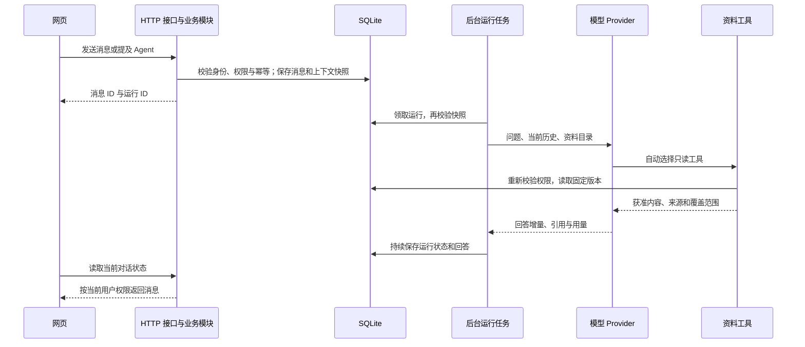

# Python 后端工程化与上下文链路

截至 2026-09-06，北京时间。对象为 Accord 当前 Python 后端；主模式为技术设计与落地验收。本文依据运行记录、当前源码和隔离测试，不把未来设计记为已实现。

## 结论与证据

**真实工具调用已经实现；读取用户全部内容尚未实现。** 当前是“在获准资料中检索，并结合当前对话回答”。截图对应的运行实际调用了 `colleague_status` 与 `context_list`，模型为 DeepSeek V4 Pro，已完成并记录用量。当时资料表为空，因此工具没有正文可读。这里只记录工具与范围，不发布成员消息、身份标识或运行日志。

“本次没有查到”不等于“这位同事没有工作”。原回答混淆了可见范围与个人全部内容，还在群聊推荐了不存在的“找本人”按钮。本次已调整提示词，目录工具增加来源归属与覆盖范围；群聊状态工具补上全体成员的私聊标题可见性校验。

## 能力边界

| 能力 | 当前实际行为 | 尚缺什么 |
| --- | --- | --- |
| 自动调用 Tools | 模型按问题选择四个只读工具，可连续读取后回答；服务端限制参数、次数和结果体积 | 外部 MCP 和工具生态尚未接入 |
| 读取资料 | 读取 Accord 中已创建、当前范围有权使用的资料版本；支持正文、集合与引用 | 本机文件夹、飞书文档的自动采集与持续同步 |
| 关联上下文 | 当前对话历史、文件夹绑定、资料版本、集合引用、课题简报与已公开方案 | 跨会话检索、记忆提炼、统一人员内容索引 |
| 找同事的 Agent | 结合共享资料与获准状态回答；不冒充本人作决定 | 不是读取同事所有私聊、草稿和本机文件 |
| 工作状态 | 本人开启后的站内状态及获准待办；群聊还按共同可见范围过滤 | 日历、线下会议与跨应用活动未接入 |
| 检索方式 | 有界关键词匹配；检索返回片段，可继续读取正文 | 尚无向量检索、重排序或知识图谱 |

不手动选资料时，普通对话自动使用授权目录；明确选择文件夹或资料后，范围随之缩小，空文件夹不会退回全局读取。共享资料可来自多个成员，不能默认认为目录内所有文件都属于被提及的人。

## 执行架构

网页提交后，消息和运行先落库；后台工作线程领取运行，通过 provider 与模型通信。模型可请求工具，工具在每次读取前校验权限与固定版本；回答、来源、状态和用量持续保存。网页通过现有接口读取更新，不要求用户停留等待。图中模型流式通信发生在服务端；当前前端使用状态查询，不是 WebSocket 推送。

入口为 `main.py`。`api` 负责 HTTP，`modules` 负责业务，`platform` 负责数据库和模型协议，`jobs` 负责后台派发。原 `app.py` 仅保留启动兼容。模块内接口、输入契约、业务服务和必要的共享查询分开；精确目录见仓库 `apps/api/README.md`。

| 模块 | 职责 |
| --- | --- |
| identity、permissions | 账号会话、成员权限、可见范围与历史边界 |
| collaboration | 单聊、群聊、转本人、任务承接 |
| workspace | 文件夹、会话归档、资料绑定、页面状态聚合 |
| knowledge | 资料 CRUD、版本、上下文快照、工具清单与执行 |
| agent_runs | 运行状态、停止重试、提示词与模型调用编排 |
| activity、preferences、topics | 站内状态、模型档位、异步探索与决策 |

## 工程取舍

参考 Rocket 的 `api / modules / platform` 分层及模块内接口、Schema、业务组织方式，只借鉴职责划分。本次采用模块化单体，保留现有 FastAPI、SQLite 与单进程后台线程。

直接引入 Rocket 的 SQLAlchemy、Celery、Redis 会同时改变持久化和调度，增加当前多人使用中的迁移成本。本轮因此不引入这些依赖。需要多实例、可靠外部队列或更复杂的数据查询时，再分别演进，而不是复制一套空架构。

业务异常统一为 `DomainError`，由 HTTP 层转换响应。Provider 不导入业务模块，不直接读数据库；资料工具通过既定接口被调用。共享查询才提取为 Repository；简单事务保留在业务模块，不把每条 SQL 包成空转发函数。

默认数据目录独立于模块路径，移动文件不会意外创建另一份工作空间。数据库初始化迁移集中管理；无调用的旧原型业务函数已移除，历史数据表与已有数据保留。迁移目前仍为显式 SQLite 脚本，不宣称已采用 ORM 或 Alembic。

## 权限与运行不变量

- 群聊只使用全体成员共同可见的资料；新增成员看不到入群前的消息。状态工具也不能转述只有发起人有权看的私聊标题。
- 一次运行固定资料版本和历史范围。撤回共享或改变群成员后，继续读取与输出会重新检查，不能用旧快照绕过当前权限。
- 当前历史最多 20 条、约 16000 字符；自动目录最多 200 项，正文分段读取。工具最多执行 12 次，provider 最多 7 轮请求。较大的资料范围需要收窄，不是无上限全量上下文。
- 模型不能确认待办、决定人员意愿或执行任意命令。找本人仍要求当前工作项内 Agent 至少完整回答一次，且没有正在运行的回答；不添加倒计时弹窗。
- 写操作保留幂等与版本校验。运行中断后保留已有结果，人工重试，不自动重复付费。
- 当前只支持一个 API 进程。多 worker / 多副本的分布式领取、故障恢复和扩容尚未实现。

## 迁移与验收

JC 已授权工程整理；影响限于后端模块、启动入口和相应验证文档。先保存当前源码及数据库一致性副本，再在隔离目录验证。重构不删除表、不迁移成员资料权限，也不改写真实聊天。

| 检查 | 结果 |
| --- | --- |
| 原有回归 | 52 项场景继续通过，包括登录、个人与群聊权限、引用撤回、停止重试、幂等和 Agent 先答 |
| 新增工程及范围检查 | 6 项通过；合计 58 项测试 |
| 接口兼容 | 重构前 49 个 API 路径的声明契约保持一致；内部 Python Schema 名称和 OpenAPI operationId 不作为网络行为契约 |
| 旧库升级 | 43 张表的全部行指纹与 SQL schema 一致；重复初始化不改变数据与结构；未登录仍拒绝读取工作空间 |
| 真实模型 | 隔离三成员群中，DeepSeek V4 Pro 实际调用 context_read，读出随机口令并返回正确引用；私有资料未进入上下文 |
| 静态检查 | 后端源码与新增工程测试的 Ruff 检查、格式检查通过 |
| 当前服务 | 确认没有排队或运行中的回答后重启 API；本机及局域网 5188 的健康检查均返回 200 |

真实模型验证使用隔离资料和低思考档位，只影响验证进程；生产模型配置未改。未验证多台物理设备、外部文档同步、多副本、容量或会议集成。本轮没有改前端，因此使用接口契约和后端回归验证兼容，未重复前端视觉验收。

本机源码和数据库备份在 `.local/backend-engineering/before`，不提交或同步云盘。若上线后入口或健康检查失败，先回退本轮源码和启动入口；本次未改数据结构，不应覆盖已经产生新消息的真实数据库。回退后以健康检查、账号可读和已有对话存在为恢复标准。

## 下一步：让内容真正进来

1. **先统一内容入口。** 将授权文件、飞书文档、任务与会议总结转为版本化资料，保留所有者、来源、更新时间、可见范围和状态；先做一个连接器验证增量更新与撤权。
2. **再补跨会话检索。** 本人可检索自己的历史；同事的 Agent 只能对外使用获准内容或共享摘要。检索候选、正文和引用都做权限检查，不能先读全库再让模型决定是否透露。
3. **最后做自动记忆。** 过程信息可自动更新；“已确认结论”需要有明确工作流事件作为依据。保留版本与纠错路径，避免让用户逐个维护每份 AI 草稿。

路演可表述为：“已实现权限控制下的真实资料问答和协作闭环，正在补个人内容自动接入。”不能表述为“已自动读取每个人所有聊天、会议与本机文件”。

## 来源

- 当前 Accord：`apps/api/accord_api`、`apps/api/tests`、`tools/run-api.py`；验证时间为 2026-09-06。
- 结构参考：本地 Rocket `py-rocket-ai-crm-platform/AGENTS.md`、`app/main.py`、`app/api/router.py`、`app/modules/agent_tool/api.py`。未复制其业务实现或部署依赖。
- 后续总体方向：[AI Memory 接入与协作记忆平台](2026-09-05-004-AIMemory接入与协作记忆平台-设计文档.md)。
