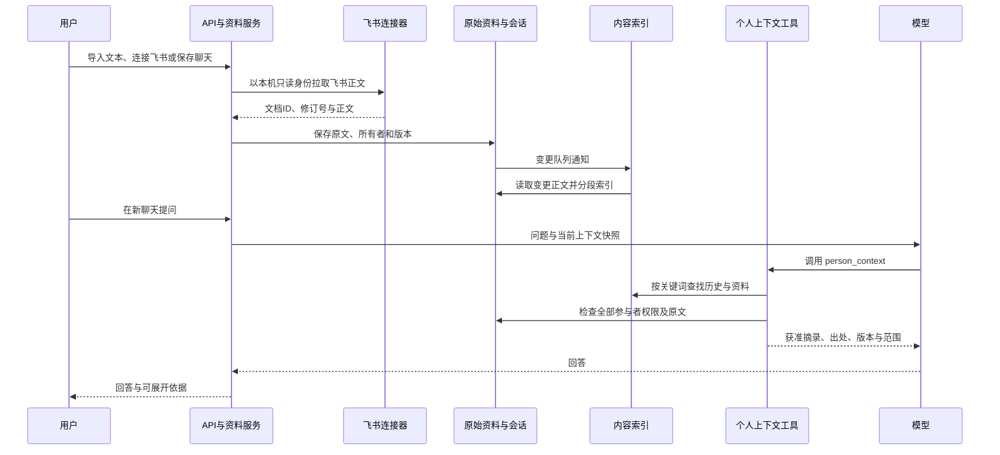

# 内容接入与跨会话检索

**站内资料、个人历史会话和本机飞书文档已经可以进入同一索引、自动关联并展开出处；团队成员独立授权和本地 App 采集尚未接入。**

2026-09-06，北京时间。主要读者：JC、产品同事与后续维护开发者。采用标准知识沉淀，保存本轮背景、取舍、已确认边界与实测证据；后半部分供开发查询。对象为 Accord 当前 FastAPI + SQLite 单进程后端及网页。

## 为什么先补内容入口和历史检索？

最初卡住的是资料没有充分进入系统，以及旧会话无法稳定检索；只有工具调用能力，还不足以回答一个人的工作内容。

JC 希望用户无需反复挑选、拖动和补充上下文，在自己的工作过程中自然留下信息，同事再向个人 Agent 查询。页面显示“已查阅”后仍返回缺少内容，促使这次检查从 UI 转向真实数据链路。先前查询只取最近一批会话和消息，较早的信息容易漏掉。

因此，本轮确认先完成“内容接入 → 统一资料索引 → 跨会话检索”，并保留精准选择资料的能力。自动查找在已有授权范围内进行；某次未查到内容，不能推断这个人没有工作。

用户在“资料”中导入文本文件，系统保存版本并自动建立索引。之后在新的个人聊天提问，Agent 可以调用 Tools，关联旧聊天和资料正文，回答下方可以展开出处。找同事的 Agent 时，只能使用对本次全部参与者获准共享的内容。

## 用户现在怎么使用？

导入一次，之后直接提问；需要核实时展开出处，需要收窄范围时再指定资料。

1. 进入“资料”，点击“导入文件”；成功后资料进入列表。相同文件重复导入不会创建副本。同名但内容不同会提示更新原资料或改名，不静默覆盖。
2. 工作空间创建者可以在“资料 → 内容连接”粘贴飞书文档链接。连接过程在当前页面展开，不弹新窗口；成功后默认仅自己可见，每十分钟检查一次更新，也可立即同步。
3. 在资料页用一个搜索框查找“我的资料与历史会话”，按正文关键词检索；展开结果可读原文摘录。清空搜索后恢复资料列表。
4. 新建个人聊天，直接问问题，无需先把旧会话拖进来。回答下方“依据”展示实际查阅的出处，点开时重新验证权限。
5. 飞书资料只有主动点击“团队可读”才向工作空间成员开放。断开连接会停止同步，已经进入 Accord 的最后成功版本继续保留；普通个人会话默认不对同事可见。

| 内容 | 实际接入方式 | 范围 |
| --- | --- | --- |
| 文本文件 | 网页“导入文件”，一次最多 20 个；Markdown、TXT、CSV、JSON | UTF-8，单文件 64 KB 内且正文最多 16000 字符；新导入默认仅自己 |
| 已有资料和记忆 | 当前资源版本自动分段建立索引 | 正文资料；集合仍通过原资料工具展开 |
| 历史会话 | 普通个人工作会话按消息分段建立索引 | 本人的人类消息及已完成 Agent 回复；归档会话不参与读取 |
| 待办与会议 | 复用个人上下文工具的实时状态查询 | 按已有状态共享开关，不将实时状态当成已确认决定 |
| 飞书文档 | “内容连接”粘贴单篇文档链接；后台定期检查，也可立即同步 | 当前使用工作空间创建者的本机 `lark-cli` 登录；默认仅自己，主动切换后团队可读 |
| 其他外部内容 | 尚未接入 | 飞书文件夹与成员独立 OAuth、本地文件夹监听、第三方聊天采集仍需连接器 |

## 同事能读到什么，撤回后怎么办？

同事只能取得本次全体参与者获准的内容；共享收回后，后续检索与历史重用也要停止使用。

- 私有资料不能因会话共享或 Agent 转述而变成团队内容。检索结果、来源预览、后续历史重用和转本人都检查引用依赖；涉及嵌套回答时递归检查，超过安全深度拒绝使用。
- 本轮选定资料仍固定版本。自动检索的资料也受本轮可用版本清单限制；当前会话从跨会话搜索中排除，避免把本次回答检索回自身。
- 检索证据写入运行快照，回答元数据保存出处；共享收回后，服务器后续读取隐藏不再获准的派生回答，后续 Agent 不得再重用。已经被接收者看过或复制的内容无法追回。
- Agent 草稿与本人记录用来源标签区分。相关性命中不等于本人已经拍板；模型不能借此创建任务、确认承诺或扩大共享。
- 没有索引完、没有命中或资料被撤回时，返回真实状态。用户可以继续工作，稍后再查，不新增倒计时或强制确认弹窗。

## 哪些结论已经实测？

2026-09-06 的隔离验收覆盖了真实模型、浏览器操作、权限回归与旧库升级；以下是当次结果，本次沉淀没有重新运行模型或测试。

真实 DeepSeek V4 Pro 验证已经通过：从另一段会话取得随机验收口令，同时从导入资料取得交付时间和所需报告，回答正确，保存了历史会话与资料两类来源；本次报告 3,633 tokens、约 4.5 秒。验证使用隔离账号、测试资料及轻量思考，没有改动真实成员聊天或生产模型档位。这是一次验证结果，不是时延承诺。

| 验证 | 结果 |
| --- | --- |
| 后端回归 | 当前完整 80 项通过；新增 3 项连接器测试覆盖创建、同步、保留旧版、共享、断开、失败恢复与本机身份隔离 |
| 关键检索场景 | 30 条后续消息之前的旧记录仍可命中；资料 4000 字符之后的片段可读 |
| 导入与权限 | 默认私有、重复导入、同名冲突、版本恢复、整批回滚、撤回共享、归档、嵌套回答及固定范围检查通过 |
| 真实模型 | 自动 Tools 调用、跨会话与文档关联、出处保存和按权限读取通过 |
| 浏览器 | 文件选择导入、中文正文搜索、原文展开、回答依据展开及“连接飞书”行内入口通过；无新增业务弹窗 |
| 真实飞书 | 隔离工作空间读取既有 006 文档修订号 3，默认私有入库，关键词“跨会话检索”可以命中；未写入正式工作空间连接记录 |
| 工程检查 | Ruff、类型检查、生产构建与 UI 组件边界检查通过；构建仍有现有主包大小提示 |
| 升级 | 在真实数据库一致性副本上验证，升级前 58 张已有表数据指纹不变，重复初始化与索引回填不改写源记录 |

验收脚本和结果保留于本地 `.local/content-index`，不上传真实数据库、原始会话或运行日志。常规测试为 `tests/test_knowledge_index.py` 及全部后端测试；模型验证在隔离服务执行。

## 哪些能力还没有接入？

这轮实现了站内内容接入、跨会话关键词检索和本机飞书单文档持续同步。尚未实现 PDF/Word 解析、每位成员独立 OAuth、飞书文件夹增量同步、本地 App 采集、语义向量检索或跨系统统一权限。当前试点只允许工作空间创建者调用本机登录，不能把 JC 电脑上的飞书身份当成全团队授权。

本轮已交付范围没有新增待拍板事项；外部接入仍是后续工作，本次不补排期、负责人或收费承诺。

---

## 开发时再看：内容怎样进入回答？

采用 SQLite FTS5，英文按词、中文按相邻双字拆分后检索；不新增向量库或外部服务。原因是当前需要准确接通数据、权限与出处，低成本验证链路。代价是同义词和模糊语义的召回有限，后续可增加向量召回和重排序，保持同一权限入口。

写入原文时，同一 SQLite 事务中的触发器记录变更。后台每轮处理最多 100 个变更，检索时额外推进最多 1000 个；初次运行先回填已有资料与消息。索引存分段正文、来源、偏移、版本及摘要指纹；FTS 只索引当前有效片段，旧片段保留用于引用验证。原文仍是唯一事实来源，索引不是新的共享授权。

每段最多 1500 字符、相邻段重叠 200 字符。关键词命中与相关片段先返回；宽泛的个人问题还可补近期背景，明确标注其未必与问题直接相关。每次个人查询最多八段，再补获准实时状态。结果注明是否还有候选、索引是否待处理，不宣称已经读完全部档案。

## 开发时再看：代码和接口在哪里？

新增能力集中在 `modules/knowledge`，延续前一轮模块化结构：

| 文件 | 职责 |
| --- | --- |
| imports.py、import_writer.py | 导入契约、同名去重、整批事务及版本更新 |
| connectors.py | 飞书链接校验、只读拉取、同步认领、资源版本和共享范围 |
| index.py | 变更消费、分段、中文分词和索引更新 |
| retrieval.py | 搜索、原文摘录、来源验证及递归引用权限检查 |
| person_context.py | 复用索引与实时状态，供聊天和会议流程调用 |
| tools.py、snapshots.py | 工具预算、运行快照、历史引用验证 |
| platform/db/migrations/knowledge_index.py | 索引、导入与外部连接记录、变更队列、触发器及幂等回填 |
| jobs/generation.py | 在现有后台协调器中串行认领到期连接，避免阻塞模型回答 |
| KnowledgeTools.tsx | 文件导入、飞书连接、全文搜索、回答依据；复用 Tutti 组件与颜色 |

站内导入与检索包含三个需要登录的 HTTP 接口：

- `POST /api/knowledge/imports`：携带 operation_id 和 files。文件有 filename、content；更新原导入项还需匹配 resource_id、expected_version。整批成功或回滚；不接受服务器路径。格式、数量、正文不合法返回 422，同名内容冲突或版本过期返回 409。
- `GET /api/knowledge/search?q=…`：1–200 字符关键词，返回本人可读的已索引资料与普通个人历史片段、has_more、index_pending。当前前端不检索他人的私有内容。
- `GET /api/knowledge/chunks/{id}`：从原始来源验证权限、版本和指纹后返回摘录。无权、归档、删除返回 404；原文改变导致引用失效返回 409。

飞书试点另有四个仅工作空间创建者可用的写接口：`POST /api/knowledge/connections/lark` 连接或恢复文档，`POST /api/knowledge/connections/{id}/sync` 立即同步，`POST /scope` 在“仅自己”和“团队可读”之间切换，`POST /disconnect` 停止后续同步。所有操作带 operation_id；后三项同时校验连接版本。远端读取失败时保留上一次成功的 Accord 资料版本。

会话中的 `person_context` 工具按被提及的人确定所有者，并以当前完整参与者集合验证，不接受模型任意指定成员。工具参数、调用次数和返回体积继续由服务端限制。此次没有引入外部 MCP。

### 如何更新服务和恢复？

服务仍是单进程 SQLite。只有在当前回答和会议整理均无排队/运行时重启，避免中断付费调用。若新版本不能通过健康检查，回退本轮源码并重启；新增索引表可保留，不用旧数据库覆盖正在新增的成员消息。恢复标准是健康接口可用、既有账号与会话可读、索引搜索及权限验证通过。

前一阶段工程整理记录见 [005 Python 后端工程化与上下文链路](2026-09-06-005-Python后端工程化与上下文链路-设计文档.md)。本篇与源码、隔离测试记录共同作为这一阶段的能力边界。
