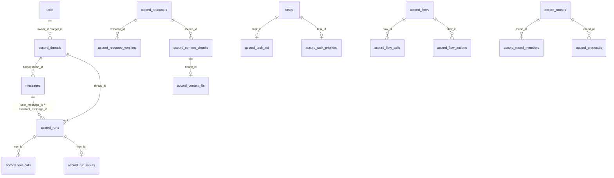

# 本地 SQLite 数据库连接与表结构

> 结论：Accord 当前使用 SQLite，TablePlus 应直接打开 `/Users/JCProjects/accord/.local/workspace/data/pool.db`。本文用于开发和排查时快速查找“哪张表存什么”，数量为 2026-09-06 04:38（Asia/Shanghai）的只读快照。

## TablePlus 要连接哪个文件？

连接当前运行中 Accord 服务的主库，不要选择 `showcase`、`validation`、`backup` 等目录下的副本。

```text
/Users/JCProjects/accord/.local/workspace/data/pool.db
```

TablePlus 连接方式：

1. 新建连接，选择 `SQLite`。
2. 在 `Database File` 或 `Database Path` 中选择上述 `pool.db`。
3. 不需要 Host、Port、Username 或 Password。
4. 日常查看建议使用只读连接；如需直接改数据，先停止 Accord API 并做完整备份。

`pool.db-wal` 和 `pool.db-shm` 是 SQLite WAL 模式的运行文件，不是另外两个数据库，不要单独打开、删除或移动。

## 为什么确定这是当前主库？

已实测的证据如下：

| 检查项 | 已实测结果 |
| --- | --- |
| 数据库类型 | SQLite |
| 运行配置 | `.env` 中 `ACCORD_DATA_DIR=/Users/JCProjects/accord/.local/workspace` |
| 代码拼接规则 | `<ACCORD_DATA_DIR>/data/pool.db` |
| 服务状态 | `com.accord.api` 正在运行，进程使用 `tools/run-api.py` |
| 日志模式 | WAL |
| 完整性 | `PRAGMA integrity_check` 返回 `ok` |
| 表规模 | 54 张普通业务/元数据表 + 1 张 FTS5 虚拟表 + 5 张 FTS5 内部影子表 |
| 当前数据文件 | `pool.db` 约 1.9 MB，运行中 WAL 约 3.7 MB |

数据路径由 [`platform/config.py`](../../apps/api/accord_api/platform/config.py) 生成，SQLite 连接和 WAL 设置在 [`platform/db/database.py`](../../apps/api/accord_api/platform/db/database.py)。

## 核心数据怎么串起来？

下图表达代码中实际使用的逻辑关联，不代表 SQLite 已声明外键。当前 schema 没有 `FOREIGN KEY` 约束，关联一致性由应用服务维护。



主链路可以理解为：

```text
成员 units
└── 会话 accord_threads
    ├── 消息 messages
    │   ├── 模型执行 accord_runs
    │   │   ├── 输入快照 accord_run_inputs
    │   │   └── 工具调用 accord_tool_calls
    │   └── 检索分块 accord_content_chunks → accord_content_fts
    └── 任务 tasks → accord_task_acl / accord_task_priorities

资料 accord_resources
├── 版本正文 accord_resource_versions
└── 检索分块 accord_content_chunks → accord_content_fts
```

## 当前库里有哪些关键数据？

这里只记录数量和状态分布，不复制聊天正文、邮箱、密码哈希、会话摘要或邀请凭据。

| 对象 | 当前快照 | 关键解读 |
| --- | --- | --- |
| 成员 | 10 | 2 个 owner、8 个 member |
| 会话 | 43 | 3 个群聊、19 个 Agent 单聊、7 个已关闭单聊、2 个等待人回复的单聊、12 个个人工作区会话 |
| 消息 | 131 | human 64、agent 45、system 22 |
| 任务 | 4 | done 3、open 1；1 条 high，3 条未设优先级 |
| 资料 | 36 | 22 条 private memory、13 条 team note、1 条 round brief，全部 active |
| 检索分块 | 95 | document 43、conversation 30、memory 22，全部 active；FTS 行数也是 95 |
| 模型执行 | 43 | done 40、error 2、cancelled 1 |
| 工具调用 | 24 | 全部 done；主要是 context search/list/read、person context 和 colleague status |
| 协调流程 | 13 | 6 个已关闭聊天总结、3 个已关闭同步、2 个分配流程、2 个任务总结 |
| 独立探索轮次 | 1 | 阶段为 exploring，有 3 个成员，暂无 proposal/submission/release |
| 幂等写操作 | 302 | 全部 done |

## 哪张表存哪些数据？

以下是可直接查询的 54 张普通业务/元数据表。“关键字段”只列最常用的定位字段，不是完整 DDL。

### 身份、登录与个人状态

| 表 | 行数 | 存放内容 | 关键字段 |
| --- | ---: | --- | --- |
| `units` | 10 | 成员与专属 Agent 基础资料 | `id`, `person_name`, `agent_name`, `window`, `report_times` |
| `accord_accounts` | 10 | 登录账号、角色和密码哈希 | `unit_id`, `email`, `password_hash`, `role` |
| `accord_sessions` | 53 | 登录会话摘要及过期时间 | `digest`, `unit_id`, `expires_at` |
| `accord_invites` | 7 | 邀请码摘要、创建人、使用人和过期时间 | `digest`, `created_by`, `used_by`, `expires_at` |
| `accord_auth_attempts` | 2 | 登录/认证失败计数和时间窗 | `scope`, `count`, `since` |
| `accord_model_preferences` | 2 | 成员的模型思考档位 | `unit_id`, `reasoning_effort` |
| `accord_activity_preferences` | 3 | 是否自动共享工作状态及显示标题 | `owner_id`, `automatic`, `work_title`, `version` |
| `accord_presence` | 2 | 客户端在线面、当前会话和最后心跳 | `owner_id`, `client_id`, `surface`, `thread_id`, `active`, `seen_at` |

### 会话、消息、找人与任务

| 表 | 行数 | 存放内容 | 关键字段 |
| --- | ---: | --- | --- |
| `accord_threads` | 43 | 个人工作区、单聊和群聊主记录 | `id`, `owner_id`, `target_id`, `kind`, `status`, `delivery_at` |
| `messages` | 131 | 当前会话消息；`conversation_id` 实际关联 `accord_threads.id` | `id`, `conversation_id`, `from_kind`, `from_unit`, `body`, `sources`, `meta` |
| `accord_group_members` | 9 | 群聊成员及加入时的消息起点 | `thread_id`, `member_id`, `joined_after` |
| `accord_thread_archives` | 1 | 每个成员对会话的归档状态 | `owner_id`, `thread_id`, `created_at` |
| `accord_thread_scopes` | 1 | 会话在独立探索/评审中的用途 | `thread_id`, `purpose`, `round_id` |
| `accord_thread_attachments` | 0 | 会话附件正文、类型、大小和发布后资料 ID | `id`, `thread_id`, `message_id`, `filename`, `content`, `published_resource_id` |
| `accord_task_acl` | 4 | 任务创建人及任务来源会话 | `task_id`, `creator_id`, `thread_id` |
| `tasks` | 4 | 待办正文、负责人、状态、产物和提醒 | `id`, `title`, `status`, `assignee_id`, `how_to`, `artifact`, `remind_at` |
| `accord_task_priorities` | 1 | 任务优先级 | `task_id`, `priority` |
| `accord_operations` | 302 | 写操作幂等记录及结果 | `actor`, `operation_id`, `fingerprint`, `status`, `result` |

### 工作区组织与资料库

| 表 | 行数 | 存放内容 | 关键字段 |
| --- | ---: | --- | --- |
| `accord_folders` | 3 | 成员的工作区文件夹 | `id`, `owner_id`, `name`, `version` |
| `accord_placements` | 2 | 会话当前所在文件夹 | `owner_id`, `thread_id`, `folder_id`, `version` |
| `accord_bindings` | 2 | 会话/对象显式包含或排除的资料 | `owner_id`, `target_kind`, `target_id`, `included`, `excluded` |
| `accord_context_folders` | 0 | 某会话持续引用的多个文件夹 | `owner_id`, `thread_id`, `folder_id` |
| `accord_context_grants` | 0 | 个人对会话/资料源的额外上下文授权 | `owner_id`, `source_kind`, `source_id`, `enabled` |
| `accord_resources` | 36 | 资料主记录，只存所有者、种类、范围、版本和活性 | `id`, `owner_id`, `kind`, `scope`, `round_id`, `version`, `active` |
| `accord_resource_versions` | 36 | 资料每个版本的标题、正文、引用和摘要 | `resource_id`, `version`, `title`, `body`, `refs`, `digest` |
| `accord_content_imports` | 0 | 本地文本导入的文件名、摘要和对应资料 | `owner_id`, `filename`, `resource_id`, `digest` |
| `accord_content_connections` | 0 | 飞书等外部内容连接器及同步状态 | `id`, `owner_id`, `provider`, `external_id`, `resource_id`, `status`, `synced_at` |

### 检索索引

| 表 | 行数 | 存放内容 | 关键字段 |
| --- | ---: | --- | --- |
| `accord_content_chunks` | 95 | 由资料、历史会话和记忆生成的可检索文本分块 | `id`, `source_key`, `owner_id`, `source_kind`, `source_id`, `body`, `digest`, `active` |
| `accord_index_queue` | 0 | 等待增量索引的 message/resource ID | `kind`, `id` |
| `accord_index_meta` | 1 | 索引回填等内部水位 | `key`, `value` |

`accord_content_fts` 是 95 行的 FTS5 虚拟表，用 `chunk_id` 关联 `accord_content_chunks.id`。`accord_content_fts_config`、`accord_content_fts_content`、`accord_content_fts_data`、`accord_content_fts_docsize`、`accord_content_fts_idx` 是 SQLite 自动维护的 5 张影子表，不应手工编辑。

### 模型执行与协调流程

| 表 | 行数 | 存放内容 | 关键字段 |
| --- | ---: | --- | --- |
| `accord_runs` | 43 | 单次 Agent 模型运行、模型、状态、用量、错误和思考内容 | `id`, `thread_id`, `actor_id`, `user_message_id`, `assistant_message_id`, `status`, `model`, `usage` |
| `accord_run_inputs` | 29 | 某次模型运行的上下文清单快照 | `run_id`, `manifest` |
| `accord_tool_calls` | 24 | 模型工具调用、资料版本和结果字符数 | `id`, `run_id`, `call_id`, `name`, `resource_id`, `status` |
| `accord_flows` | 13 | 同步、任务总结、分配、聊天收尾等协调流程 | `id`, `owner_id`, `kind`, `status`, `member_ids`, `thread_id`, `task_id` |
| `accord_flow_calls` | 29 | 协调流程对各成员的模型调用状态和用量 | `id`, `flow_id`, `person_id`, `status`, `source_count`, `usage` |
| `accord_flow_memories` | 22 | 协调流程实际使用的成员记忆资料 | `flow_id`, `owner_id`, `resource_id` |
| `accord_flow_actions` | 1 | 协调流程提议/确认的行动及任务 | `id`, `flow_id`, `assignee_id`, `title`, `status`, `task_id` |

### 独立探索与集中决策

| 表 | 行数 | 存放内容 | 关键字段 |
| --- | ---: | --- | --- |
| `accord_rounds` | 1 | 独立探索轮次、阶段、截止时间和最终决策 | `id`, `title`, `owner_id`, `brief_id`, `stage`, `deadline`, `decision_id` |
| `accord_round_members` | 3 | 轮次参与成员 | `round_id`, `member_id` |
| `accord_proposals` | 0 | 成员在轮次中的方案正文与来源 | `id`, `round_id`, `author_id`, `title`, `body`, `sources` |
| `accord_submissions` | 0 | 每位成员当前提交的方案版本 | `round_id`, `member_id`, `proposal_id`, `version` |
| `accord_releases` | 0 | 集中公开后的方案与发布资料 | `round_id`, `proposal_id`, `resource_id`, `created_at` |
| `accord_decision_handoffs` | 0 | 决策后交给某成员的会话 | `round_id`, `target_id`, `thread_id` |

### 兼容保留和系统元数据

| 表 | 行数 | 存放内容 | 当前判断 |
| --- | ---: | --- | --- |
| `conversations` | 0 | 旧原型的双人会话 | 已由 `accord_threads` 承担当前会话主记录 |
| `handoffs` | 0 | 旧原型的找人交接 | 当前交接状态主要在 `accord_threads` |
| `routes` | 0 | 旧原型的问路/回答记录 | 兼容保留 |
| `decisions` | 0 | 旧原型的会议决策 | 兼容保留，当前独立探索使用 `accord_rounds` 系列 |
| `meeting_msgs` | 0 | 旧决策会消息 | 兼容保留 |
| `scratch` | 0 | 旧过程文件指针 | 兼容保留；新会话附件用 `accord_thread_attachments` |
| `artifacts` | 0 | 旧成果正文/文件路径 | 兼容保留；新共享资料用 `accord_resources` |
| `memories` | 0 | 旧成员记忆 | 兼容保留；当前记忆使用 `accord_resources` + `accord_resource_versions` |
| `duty_log` | 0 | 旧值班 Agent 日志 | 兼容保留 |
| `project_state` | 1 | 项目级键值状态 | 当前只有 `workspace_name` 键 |
| `accord_schema_versions` | 1 | 数据库 schema 版本和应用时间 | 当前版本记录为 1 |

## 用 TablePlus 查数据时先看什么？

常用入口是 `accord_threads` 和 `messages`，资料查 `accord_resources` 和 `accord_resource_versions`，模型调用查 `accord_runs`。

```sql
-- 会话及消息量，不读消息正文
SELECT
  t.id,
  t.title,
  t.kind,
  t.status,
  COUNT(m.id) AS message_count,
  t.updated_at
FROM accord_threads AS t
LEFT JOIN messages AS m ON m.conversation_id = t.id
GROUP BY t.id
ORDER BY t.updated_at DESC;

-- Agent 运行状态分布
SELECT status, model, reasoning_effort, COUNT(*) AS run_count
FROM accord_runs
GROUP BY status, model, reasoning_effort
ORDER BY status, model, reasoning_effort;

-- 资料类型与可见范围
SELECT kind, scope, active, COUNT(*) AS resource_count
FROM accord_resources
GROUP BY kind, scope, active
ORDER BY kind, scope, active;
```

### 查看和修改数据的边界

- `messages.body`、`accord_resource_versions.body`、`accord_runs.reasoning_content` 可能包含聊天、资料和模型思考正文，不应在无关文档、工单或群聊中复制。
- `accord_accounts.password_hash`、`accord_sessions.digest`、`accord_invites.digest` 是安全字段，不要导出或分享实际值。
- 直接改主键、状态或 JSON 字段可能绕过权限、版本和幂等检查。日常数据修改应通过 Accord API，TablePlus 主要用于只读排查。
- 当前表之间没有 SQLite 外键声明，手工删行不会自动级联，更容易留下孤儿数据。
- 需要备份运行中数据库时，应使用 SQLite 在线 backup 能力或先停 API；不要在 WAL 未合并时只拷贝 `pool.db`。

## 这份梳理的证据和限制是什么？

**已实测：**

- 主库路径、服务进程、WAL 模式、完整性、当前表、列、索引、触发器、行数和状态分布均来自本机只读查询。
- 核心逻辑关联已对照 `apps/api/accord_api/modules` 中实际 SQL 读写。

**限制：**

- 数量是时点快照；Accord API 仍在运行，后续行数会变化。
- 文档只记录关键字段和用途，完整列定义以 TablePlus 的 Structure 视图和 `apps/api/accord_api/platform/db/migrations` 为准。
- “兼容保留”根据当前行数、迁移代码和业务模块的实际读写路径判断；未授权删表或数据清理。
