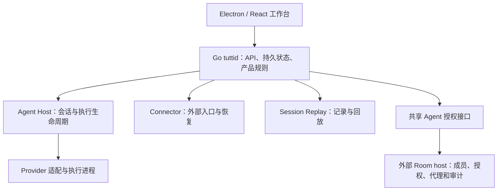

# Tutti 参考项目

> 检查日期：2026-09-05。参考仓库：[tutti-os/tutti](https://github.com/tutti-os/tutti)。本地路径：`/Users/JCProjects/tutti`。检查 commit：`404a084f7780c475212f80d6563964c4bd7d8324`。已阅读 README、部分核心包与架构资料，并从源码启动本地桌面版；不是完整源码审计或 Tutti VM 云端实测。

## 判断

**Tutti 属于竞品，Tutti VM 与 Accord 的团队协作方向尤其直接重叠。** 开源本地版也会竞争用户管理 Agent 的工作入口，但其独立运行形态与 Accord 的多人协作流程不同。

我的产品判断：Tutti 主要把 Agent 的执行现场、文件、工具和上下文组织到一起；Accord 应聚焦协作请求如何被接住、何时找真人、谁确认结论及承担任务。这个聚焦需要由实际行为证明，不能直接宣称 Accord 已有更好的权限或协作可靠性。

堡天 MVP 已启动并发现具体问题，见 [原型验收记录](../产品规划/2026-09-05-003-现有原型评估与比赛收口-验收记录.md)。考虑 9 月 6 日中午提交，建议继续现有 MVP，少量借鉴 Tutti 的机制；**尚未 Fork、复制 Tutti 业务代码或完成独立模块复用验证。**

## 竞品拆解

以下 Tutti VM 能力根据 [官网](https://tutti.sh/zh) 核对，属于官方产品描述；开源版边界另对照固定 commit 的 README 和架构文档。官网版本表的图标在纯文本中会丢失，因此以其 FAQ 的版本说明为准。

| 维度 | Tutti / Tutti VM 的相关设计 | Accord 要做的选择 |
| --- | --- | --- |
| 用户起点 | 本地版从 Agent 会话、项目与工具进入；VM 面向多人共享工作现场 | 从“我需要哪个同事帮忙”进入，先解释人和 Agent 的责任 |
| 上下文 | VM 强调共享项目状态和跨 Agent 引用 | 明确区分个人草稿、可代答事实、共享成品，来源可查看 |
| 多人机制 | VM 提供房间协作、借用 Agent 和撤回授权 | 先把“问同事的 Agent”和“请同事本人决定”分清 |
| 状态呈现 | VM 的 Agent Board 展示工作、完成、失败等状态 | 请求展示代答中、待本人、已回复、待确认、已落地；模型失败要可见 |
| 产物 | VM 强调产出与共享，桌面工作台有文件 / 应用入口 | 过程附件默认个人可见，成品明确入池；保留确认动作 |
| 核心价值 | 依据上述材料，我的归纳是降低多 Agent 的执行与共享成本 | 把减少无效打扰、交接缺失和责任不清作为要验证的价值 |

不要在 PPT 中把“支持多人”“每人有自己的 Agent”“共享上下文”写成独有创新；也不能仅凭本轮观察断言 Tutti 没有人工确认或细粒度权限。可以比较具体的协作请求流程、目标用户和演示证据。

## 本地启动验收

- 已执行 `pnpm install --frozen-lockfile`、Go 模块下载及 `make dev-gui`；内置应用、Go daemon、CLI、Claude SDK sidecar 和 Electron 开发构建完成。
- 实际环境：Node 24.20.0、pnpm 10.11.0、Go toolchain 1.24.5，macOS ARM64。
- launchd 服务为 `com.accord.tutti-reference`；启动脚本和 plist 在 Accord 的 `.local/runtime/`，日志 `/tmp/accord-tutti-reference.log`。
- 使用独立 `TUTTI_STATE_DIR=/Users/JCProjects/accord/.local/runtime/tutti-state`；`TUTTI_DEV_SKIP_PATH_SHIM=1` 避免覆盖已有 CLI 入口。
- 桌面窗口 **Tutti Dev** 已实际出现：Agent 页面有多个 Provider、项目与会话入口；工作台有 Agent、文件、浏览器、终端、应用、任务和启动台。
- 实测 daemon 位于 `127.0.0.1:63138`，鉴权后的 `/v1/health` 返回 HTTP 200、`status=ok`；端口可能随重启变化。未鉴权请求返回 401。
- 这次没有发起真实模型任务；初始 Agent 界面提示需连接或配置模型。没有登录、创建云端房间、借用他人 Agent 或验证 VM 能力。
- 截图为本地附件：`screenshots/2026-09-05-竞品与原型评估/02-图蒂工作台-1223x768.png`。Tutti 无跟踪源码改动；启动生成了依赖、构建文件及未跟踪的 `apps/desktop/build/rtk/`。

仅打开 Vite 的 5173 页面不等同于 Electron 完整能力，体验应使用 **Tutti Dev** 窗口。重启 / 停止指令见 [Accord README](../../README.md)。

## 官方描述与边界

官方 [中文 README](https://github.com/tutti-os/tutti/blob/404a084f7780c475212f80d6563964c4bd7d8324/README.zh-CN.md) 区分：开源版主要承载个人多 Agent 工作空间，多人、跨设备和跨用户 Agent 协作列在 Tutti VM。

[Workspace Agent 架构](https://github.com/tutti-os/tutti/blob/404a084f7780c475212f80d6563964c4bd7d8324/docs/architecture/workspace-agents-and-automation.md) 进一步说明：共享 Agent 有访问控制与审计接口，但 standalone 没有跨用户目录/控制平面；外部 Room host 需要实现成员关系、授权生命周期、代理调用及审计。

因此可以参考这些接口设计，但仍需为 Accord 核查或建设成员身份、个人/项目知识可见范围、代答授权、升级策略和确认记录。存在接口不等于多人业务开箱即用。

## 值得看的位置

| Accord 的问题 | Tutti 已读入口 | 可借鉴的内容 |
| --- | --- | --- |
| Agent 会话如何统一启动、恢复与取消 | [Agent Host](https://github.com/tutti-os/tutti/blob/404a084f7780c475212f80d6563964c4bd7d8324/packages/agent/host/README.md) | Provider 无关的生命周期与持久化边界、重试和恢复机制 |
| 配置变更后如何解释旧会话 | [Workspace Agent](https://github.com/tutti-os/tutti/blob/404a084f7780c475212f80d6563964c4bd7d8324/docs/architecture/workspace-agents-and-automation.md) | Agent 与模型配置分离、启动配置快照、当前授权撤回 |
| 飞书等入口如何避免与产品核心绑死 | [Connector](https://github.com/tutti-os/tutti/blob/404a084f7780c475212f80d6563964c4bd7d8324/packages/connector/README.md) | 契约、运行时、应用层和产品装配分别负责 |
| 状态与失败如何复现 | [Session Replay](https://github.com/tutti-os/tutti/blob/404a084f7780c475212f80d6563964c4bd7d8324/packages/agent/session-replay/README.md) | 记录/回放边界、产物与运行时状态分离 |
| 需要人处理的事项怎么集中呈现 | 实际 Agent 窗口的任务、消息入口与工作台待处理状态 | 减少面板来回查找；本轮只验证入口，没有对审批工作流做完整验收 |

代码组织可以简化理解为：

三个最值得借鉴的规则：生命周期只有一个服务端权威入口；界面上的权限快照不能替代每次调用的授权检查；恢复与回放不能混成真实执行。Accord 当前旧接口绕行、全量快照和模型直接落库的问题，都应在这几个边界内修正。

## 技术与复用代价

已检查根 `package.json`、桌面应用 `package.json` 和 `services/tuttid/go.mod`：Tutti 是含桌面应用、TypeScript 包与 Go 服务的多包仓库；根配置要求 Node >=24、pnpm 10.11.0，Go 服务声明 Go 1.24.3 / toolchain 1.24.5。

这些是该 commit 的参考环境要求，不是 Accord 的选型。团队已有 Demo 资料描述 FastAPI + SQLite + 静态网页，直接引入 Tutti 多包结构会增加需要评估的工程范围。

若未来引入代码，应逐模块记录：来源路径与 commit、依赖闭包、所需进程和运行环境、行为测试、迁移成本、实际复用的收益。先确定要解决哪一个问题，再决定引入多少代码。

## 许可与来源记录

根 [LICENSE](https://github.com/tutti-os/tutti/blob/404a084f7780c475212f80d6563964c4bd7d8324/LICENSE) 标注 Apache-2.0，另有 [NOTICE](https://github.com/tutti-os/tutti/blob/404a084f7780c475212f80d6563964c4bd7d8324/NOTICE) 和第三方归属说明。实际复用前逐项保留适用的许可与来源记录。本次未向 Accord 复制 Tutti 代码，也未据此给 Accord 选择开源许可证。

## 尚未完成的检查

- 已完成桌面启动和主要入口观察；需要人审批、失败恢复、上下文引用的完整交互仍待验证。
- 某个具体包能否独立复用、所需改造量及依赖许可清单。
- 跨成员数据隔离能否满足 Accord 的业务权限模型。
- 云端旧调研提及的 Issue、安全状况、VM 商业能力及附件报告；本次没有重复验证，未据此下当前结论。

## 2026-09-05 技术架构复核补充

进一步全文搜索发现，`SharedAgentAccessController` / `SharedAgentAccessAuditor` 在当前固定 commit 中仅匹配架构 Markdown，未找到同名 Go 实现。上文的共享接口与图示应理解为文档描述的设计边界，不能当作已验证的运行时代码或 VM 实测结果。详细证据与其他参考见 [003 多智能体协作参考实现](2026-09-05-003-多智能体协作参考实现-调研记录.md)，Accord 的建议见[多人多智能体协作架构](../技术架构/2026-09-05-001-多人多智能体协作架构-设计文档.md)。

当前工作区另有已获 JC 授权的 Tutti UI 接入任务，正在独立推进；本记录前述“未复制代码”的结论只描述本轮竞品启动检查时点，不代表其后 UI 任务的最新状态。
